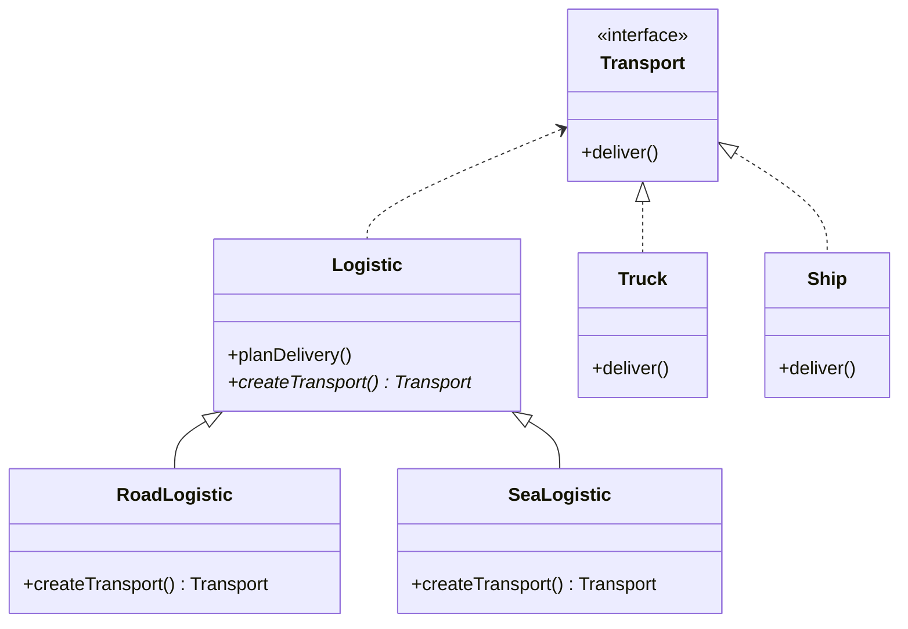

# Factory Method Pattern

The Factory Method is a creational design pattern that provides an interface for creating objects in a superclass, but allows subclasses to alter the type of objects that will be created.

## The Problem
Imagine you’re creating a logistics management application. The first version of your app can only handle transportation by **Trucks**. Most of your code lives inside the `Truck` class.

After a while, your app becomes popular, and you need to incorporate **Ships** into the logistics. Adding `Ship` to the codebase requires changing the entire core logic, which is coupled to `Truck`.

## The Solution: Factory Method
The Factory Method suggests that you replace direct object construction calls (`new Truck()`) with calls to a special factory method.

###  Class Diagram



###  Implementation in TypeScript

```typescript
interface Transport {
  deliver(): string;
}

class Truck implements Transport {
  deliver() { return "Delivering by land in a crate."; }
}

class Ship implements Transport {
  deliver() { return "Delivering by sea in a container."; }
}

// The Creator class
abstract class Logistics {
  public abstract createTransport(): Transport;

  public planDelivery(): string {
    const transport = this.createTransport();
    return `Logistics: ${transport.deliver()}`;
  }
}

class RoadLogistics extends Logistics {
  public createTransport(): Transport {
    return new Truck();
  }
}

class SeaLogistics extends Logistics {
  public createTransport(): Transport {
    return new Ship();
  }
}

// Client Code
function startLogistics(creator: Logistics) {
  console.log(creator.planDelivery());
}

startLogistics(new RoadLogistics());
startLogistics(new SeaLogistics());
```

## Why it matters
1. **Decoupling**: The high-level `Logistics` class doesn't need to know the specific types of `Transport` it creates.
2. **Single Responsibility**: You can move the product creation code into one place in the program.
3. **Open/Closed Principle**: You can introduce new types of products into the program without breaking existing client code.
