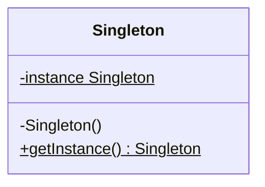

# Singleton Pattern

Singleton is a creational design pattern that lets you ensure that a class has only one instance, while providing a global access point to this instance.

## The Problem
Sometimes we need exactly one instance of a class to coordinate actions across the system. 
- Example: A **Database Connection Pool**, a **File System** manager, or a **Global State** (like Redux store).

If you create multiple instances of these, you might end up with inconsistent data, resource leaks, or unexpected behavior.

## The Solution: Singleton
The Singleton pattern hides the constructor and provides a static method that returns the same instance every time it's called.

###  Diagram



###  Implementation in TypeScript

```typescript
class Database {
  private static instance: Database | null = null;

  // Private constructor prevents direct instantiation
  private constructor() {
    console.log("Connecting to the database...");
  }

  public static getInstance(): Database {
    if (!Database.instance) {
      Database.instance = new Database();
    }
    return Database.instance;
  }

  public query(sql: string) {
    console.log(`Executing: ${sql}`);
  }
}

// Client Code
const db1 = Database.getInstance();
const db2 = Database.getInstance();

console.log(db1 === db2); // true - both are the same instance!
```

## Why it matters
1. **Resource Control**: Ensures that heavy resources (like DB connections) are not duplicated unnecessarily.
2. **Global Access**: Provides a safe way to access a shared resource from anywhere in the application.
3. **Lazy Initialization**: The instance is only created when it's first needed.

## The "Caution"
Singletons are often considered an **Anti-pattern** in modern development if overused.
- They introduce **Global State**, which makes unit testing difficult (states can leak between tests).
- They can hide dependencies in your code.
- In multi-threaded environments (like Java/C++), you need to be careful with thread safety (though JS is single-threaded, it's a good interview point).
