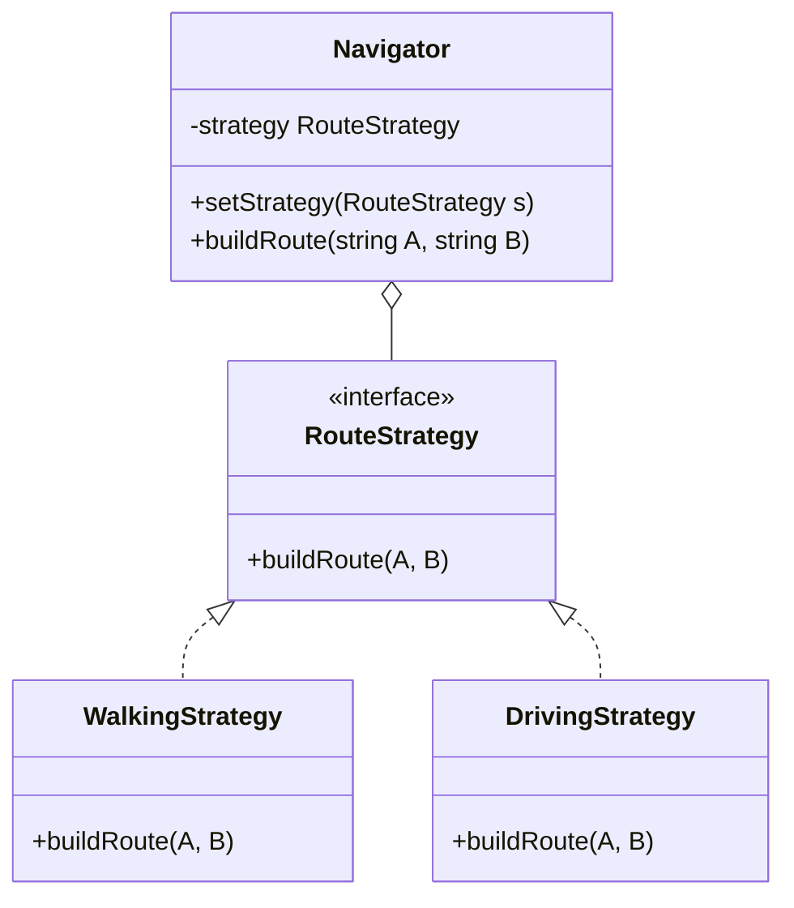

# Strategy Pattern

Strategy is a behavioral design pattern that lets you define a family of algorithms, put each of them into a separate class, and make their objects interchangeable.

## The Problem
Suppose you're building a navigation app for travelers. The app initially could only show walking routes.
Soon, you add cycling routes, then a car option, and finally public transport.

Each time you add a new routing algorithm, the main `Navigator` class doubles in size. The class becomes massive and hard to maintain. A change in the "Walking" logic might accidentally break the "Cycling" logic.

## The Solution: Strategy
The Strategy pattern suggests that you take a class that does something specific in a lot of different ways and extract all of these algorithms into separate classes called *strategies*.

###  Diagram



###  Implementation in TypeScript

```typescript
interface RouteStrategy {
  buildRoute(A: string, B: string): void;
}

class WalkingStrategy implements RouteStrategy {
  buildRoute(A: string, B: string) {
    console.log(`Walking route from ${A} to ${B}: 30 mins.`);
  }
}

class DrivingStrategy implements RouteStrategy {
  buildRoute(A: string, B: string) {
    console.log(`Driving route from ${A} to ${B}: 10 mins.`);
  }
}

class Navigator {
  private strategy: RouteStrategy;

  constructor(strategy: RouteStrategy) {
    this.strategy = strategy;
  }

  setStrategy(strategy: RouteStrategy) {
    this.strategy = strategy;
  }

  buildRoute(A: string, B: string) {
    this.strategy.buildRoute(A, B);
  }
}

// Client Code
const nav = new Navigator(new WalkingStrategy());
nav.buildRoute("Home", "Gym");

nav.setStrategy(new DrivingStrategy());
nav.buildRoute("Home", "Office");
```

## Why it matters
1. **Runtime Switching**: You can swap the algorithm being used by an object at runtime.
2. **Open/Closed Principle**: You can introduce new strategies without having to change the `Navigator`.
3. **Isolation**: You isolate the implementation details of an algorithm from the code that uses it.
