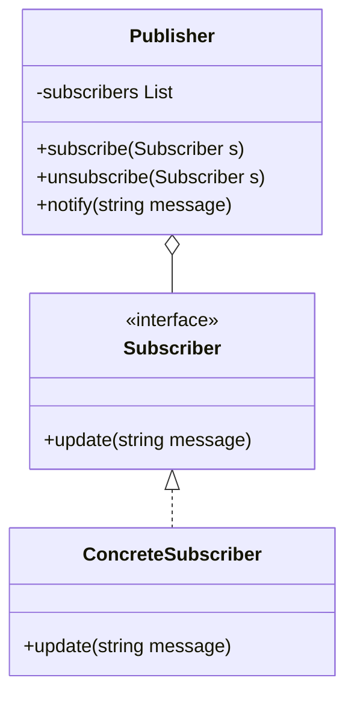

# Observer Pattern

Observer is a behavioral design pattern that lets you define a subscription mechanism to notify multiple objects about any events that happen to the object they’re observing.

## The Problem
Imagine you have a `News` website. You want to notify your `Subscribers` every time a new article is published. 

A naive way would be for every subscriber to periodically check the news website (Polling). This is incredibly inefficient and wastes resources.

## The Solution: Observer
The object that has some interesting state is often called the *subject*, but since it’s also going to notify other objects about changes to its state, we’ll call it the *publisher*. All other objects that want to track changes to the publisher’s state are called *subscribers*.

###  Diagram



###  Implementation in TypeScript

```typescript
interface Subscriber {
  update(message: string): void;
}

class NewsPublisher {
  private subscribers: Subscriber[] = [];

  subscribe(s: Subscriber) {
    this.subscribers.push(s);
  }

  unsubscribe(s: Subscriber) {
    this.subscribers = this.subscribers.filter(sub => sub !== s);
  }

  notify(message: string) {
    for (const s of this.subscribers) {
      s.update(message);
    }
  }
}

class EmailSubscriber implements Subscriber {
  constructor(private email: string) {}
  update(message: string) {
    console.log(`Email to ${this.email}: ${message}`);
  }
}

class PushSubscriber implements Subscriber {
  update(message: string) {
    console.log(`Push notification: ${message}`);
  }
}

// Client Code
const news = new NewsPublisher();

const s1 = new EmailSubscriber("dev@example.com");
const s2 = new PushSubscriber();

news.subscribe(s1);
news.subscribe(s2);

news.notify("Phase 2 content is live!");
```

## Why it matters
1. **Loose Coupling**: The publisher doesn't need to know anything about the subscriber classes, other than that they implement a specific interface.
2. **Dynamic Relationships**: Subscribers can join or leave the notification list at any time during runtime.
3. **Event-Driven**: This is the core of modern event-driven architectures and reactive programming (e.g., RxJS, Vue/React reactivity).
