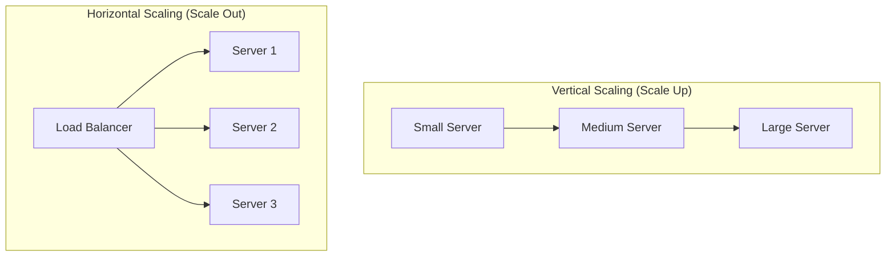

Scalability is the ability of a system to handle increasing load (users, traffic, data) **without degrading performance**. It is a core requirement for building reliable, production-grade systems.

A scalable system should:

- Handle growth in users and requests
- Maintain acceptable latency
- Avoid bottlenecks
- Optimize cost as it grows

---

## Types of Scalability

### 1. Vertical Scaling (Scaling Up)

Vertical scaling means increasing the capacity of a **single machine** by upgrading hardware.

#### Examples

- Upgrading CPU (more cores)
- Increasing RAM
- Moving from HDD → SSD/NVMe
- Using more powerful cloud instances (e.g., t2.micro → c5.4xlarge)

---

### Characteristics

- **Simplicity**
  - No architectural changes required
  - Works with monolithic applications
  - No need for distributed coordination

- **Low Operational Overhead**
  - Easier deployment and debugging
  - No distributed tracing required

- **Hardware Limits**
  - Physical ceiling exists (cannot scale infinitely)
  - Eventually you hit max RAM/CPU limits

- **Single Point of Failure (SPOF)**
  - Entire system depends on one machine
  - Downtime = total outage

- **Cost Curve**
  - Costs increase **non-linearly**
  - High-end machines are disproportionately expensive

---

### When Vertical Scaling Breaks

- CPU utilization consistently near 100%
- Memory exhaustion / swapping
- Database queries slowing down due to resource limits
- Traffic spikes causing crashes

 At this point, scaling up further becomes inefficient → you must scale out.

---

## 2. Horizontal Scaling (Scaling Out)

Horizontal scaling means adding **more machines (nodes)** to distribute load.

Instead of making one machine stronger, you make **many machines work together**.

---

### Characteristics

- **Elastic & Dynamic**
  - Add/remove servers based on demand (auto-scaling)
  - Ideal for cloud environments

- **High Availability**
  - Failure of one node does not impact entire system
  - Traffic rerouted automatically

- **Fault Tolerance**
  - Redundancy ensures system survives failures

- **Distributed Complexity**
  - Requires:
    - Load balancers
    - Distributed databases
    - Cache coordination
    - Session management

- **Near Infinite Scaling**
  - Practically unbounded (depends on architecture)

---

### Core Components Required

#### Load Balancer

- Distributes incoming requests across servers
- Prevents overload on a single node
- Common algorithms:
  - Round Robin
  - Least Connections
  - Weighted routing

#### Stateless Services

- Servers should not store session state locally
- Use:
  - Redis (session store)
  - JWT (stateless auth)

#### Distributed Data Layer

- Database replication
- Sharding
- Distributed caching

---

### Challenges in Horizontal Scaling

- **Data Consistency**
  - Keeping data in sync across nodes

- **Session Management**
  - Sticky sessions vs shared session stores

- **Network Latency**
  - Communication between nodes adds overhead

- **Debugging Complexity**
  - Issues are harder to trace in distributed systems

- **Deployment Complexity**
  - Requires orchestration (Docker, Kubernetes)

---

## Comparison Diagram

