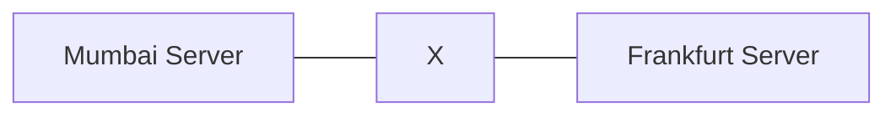
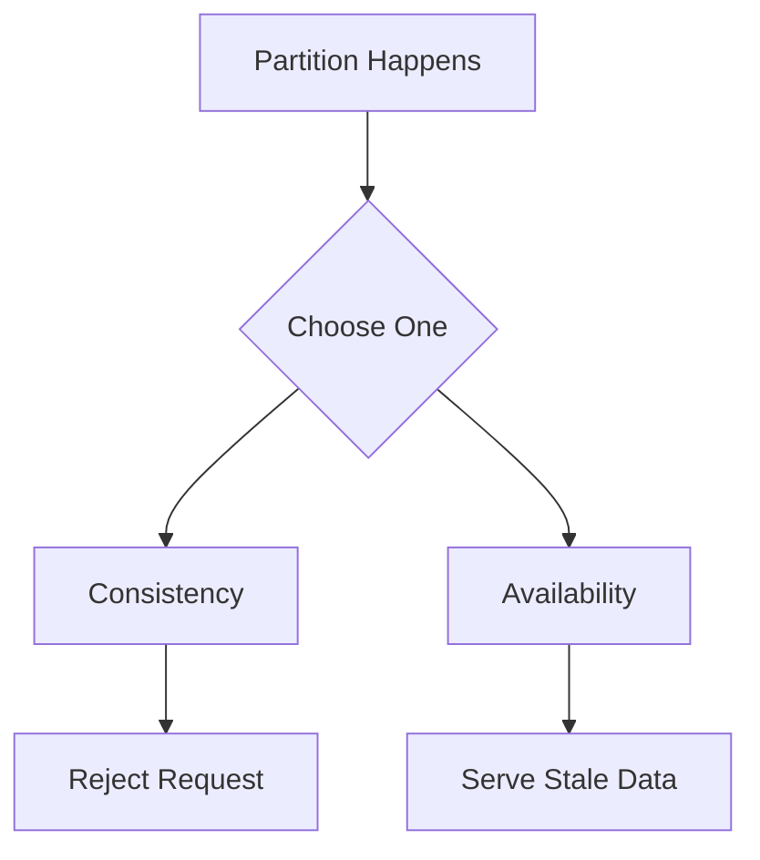

If you’ve ever worked with distributed systems, you’ll eventually run into the CAP theorem. It is one of the most important concepts to understand before designing scalable systems.

At a high level, the CAP theorem states:

A distributed system cannot guarantee Consistency, Availability, and Partition Tolerance all at the same time.

However, the real meaning is more practical:

When a network partition happens, you must choose between Consistency and Availability.

---

## Building Intuition

Imagine you have two servers:

- Server A (Mumbai)
- Server B (Frankfurt)

Both store the same data.

Now suppose the network between them breaks.

This is called a network partition.

Mermaid diagram:

Now:

- A user updates data on Mumbai
- Another user reads from Frankfurt

Frankfurt does not have the latest data.

So what should it do?

---

## The Three Guarantees

### Consistency

Consistency means every read returns the latest write.

If data is updated anywhere, all future reads must reflect it immediately.

Example:
If your bank balance is updated, every system must show the exact same value.

---

### Availability

Availability means every request gets a response.

The system never rejects a request, even if the response is not perfectly up to date.

Example:
A social media app loads instantly, even if some posts are slightly outdated.

---

### Partition Tolerance

Partition tolerance means the system continues to operate even when network communication fails.

This is unavoidable in real systems:

- Networks fail
- Messages drop
- Data centers disconnect

---

## The Core Trade-off

When a partition occurs, the system must choose:

---

## Scenario Walkthrough

Let’s walk through what happens during a partition:

1. Data is updated on Mumbai server
2. Frankfurt cannot receive the update
3. A user queries Frankfurt

Now the system must decide:

---

### Option 1: Choose Consistency (CP)

- Frankfurt refuses to respond
- It waits for correct data

Result:

- Data is always correct
- Some requests fail

---

### Option 2: Choose Availability (AP)

- Frankfurt responds immediately
- It may return outdated data

Result:

- System stays responsive
- Data may be temporarily inconsistent

---

## CP Systems

These systems prioritize correctness.

They would rather fail than return wrong data.

Use cases:

- Banking
- Payments
- Inventory

Examples:

- ZooKeeper
- etcd
- HBase

---

## AP Systems

These systems prioritize availability.

They always respond, even if data is slightly stale.

Use cases:

- Social media
- Search
- Recommendation systems

Examples:

- Cassandra
- DynamoDB
- CouchDB

---

## Important Clarification

CA systems assume no partition happens.

But in real distributed systems, partitions always happen.

So:

- CA is not realistic for distributed systems

---

## What Happens After Partition?

In AP systems:

- Data becomes inconsistent temporarily
- Background processes sync it later

This is called eventual consistency.

---

## PACELC Theorem

CAP only talks about failure scenarios.

PACELC extends it:

If Partition → choose Availability or Consistency  
Else → choose Latency or Consistency

Example:

| System    | Partition Choice | Normal Choice |
| --------- | ---------------- | ------------- |
| DynamoDB  | Availability     | Low latency   |
| Cassandra | Availability     | Low latency   |
| BigTable  | Consistency      | Consistency   |

---

## Final Takeaway

CAP is about trade-offs.

You cannot avoid partitions.

So you must choose:

- Correctness (Consistency)
- Responsiveness (Availability)

The right choice depends on your system.
