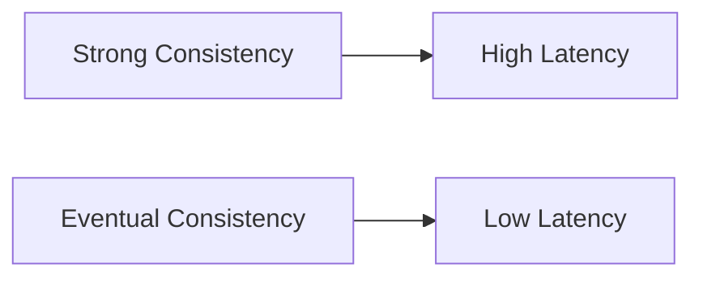

Before understanding consistency models, we need to answer a simple question:

**What is consistency in distributed systems?**

Consistency defines **what value a user reads after someone writes data**.

In a single-machine system, this is trivial:

- You write data
- You read it back
- You always get the latest value

But in distributed systems:

- Data is stored on multiple nodes
- Updates take time to propagate
- Different users may hit different servers

This creates a problem:

> Two users may see different versions of the same data.

Consistency models define **rules for how this behavior should work**.

---

## Why Consistency is Required

Without consistency rules:

- Users may see outdated or conflicting data
- Systems may behave unpredictably
- Business logic can break

### Example

Imagine an e-commerce app:

- User A buys the last item
- User B still sees it as available

This leads to:

- Overselling
- Data corruption
- Poor user experience

Consistency models help define:

- How quickly updates are visible
- What guarantees the system provides

---

## The Core Trade-off

There is no perfect system.

> Stronger consistency = Higher latency + lower availability  
> Weaker consistency = Better performance + possible stale data

---

## Types of Consistency

---

## 1. Strong Consistency

Strong consistency guarantees:

> After a write completes, all future reads will return that value.

There is no ambiguity.

---

### How It Works

- All nodes must agree on the latest value
- Writes are synchronized across replicas
- Often uses consensus algorithms (Raft, Paxos)

---

### Example

Banking system:

- You deposit money
- Immediately check balance
- You must see updated value

Anything else is unacceptable.

---

### Characteristics

- Always returns latest data
- No stale reads
- Higher latency
- Lower availability during failures

---

### Databases

- Google Spanner
- CockroachDB

---

## 2. Eventual Consistency

Eventual consistency guarantees:

> If no new updates happen, all nodes will eventually have the same value.

But not immediately.

---

### How It Works

- Writes are accepted quickly
- Updates propagate in the background
- Nodes sync over time

---

### Example

Social media likes:

- You like a post
- Count may show different numbers for different users
- Eventually, it becomes consistent

---

### Characteristics

- Very fast reads and writes
- High availability
- Temporary inconsistency
- Requires conflict resolution

---

### Databases

- DynamoDB
- Cassandra

---

## 3. Causal Consistency

Causal consistency sits between strong and eventual.

It guarantees:

> Related operations are seen in the correct order.

---

### Example

Chat system:

1. User sends: "Hello"
2. User replies: "How are you?"

System must ensure:

- "Hello" appears before "How are you?"

But:

- Messages from different chats can arrive in any order

---

### Characteristics

- Preserves cause-effect relationships
- More relaxed than strong consistency
- More structured than eventual consistency

---

## Visual Trade-off

---

## Real-World Analogy

Think of consistency like messaging:

- Strong consistency → Phone call (instant, synchronized)
- Eventual consistency → Email (delayed but reliable)
- Causal consistency → Chat threads (order matters within context)

---

## When to Use Which

### Use Strong Consistency When

- Data must always be correct
- Errors are unacceptable

Examples:

- Banking
- Payments
- Inventory systems

---

### Use Eventual Consistency When

- Slight delays are acceptable
- High performance is required

Examples:

- Social media feeds
- Analytics dashboards
- Recommendation systems

---

### Use Causal Consistency When

- Order matters within a context

Examples:

- Chat systems
- Comment threads
- Collaborative apps

---

## Consistency in CAP Theorem

In CAP:

- C = Strong Consistency

During partition:

- Choose Consistency → CP system
- Choose Availability → AP system

---

## Practical Insight

Modern systems are flexible:

- Offer tunable consistency
- Allow choosing per operation

Example:

- Strong read for payments
- Eventual read for feed

---

## Key Takeaways

- Consistency defines what data users see
- Strong consistency = correctness
- Eventual consistency = performance
- Causal consistency = ordered correctness

> Always choose based on business requirements, not defaults
