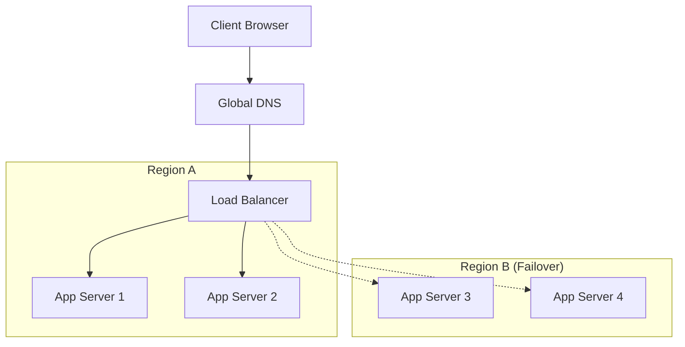

Availability is the percentage of time a system remains operational and accessible to users. In high-scale systems, "High Availability" (HA) is a core requirement.

## Measuring Availability (The "Nines")

Availability is often expressed as a series of nines.

| Availability % | Downtime per Year | Class |
| :--- | :--- | :--- |
| **99% (Two Nines)** | 3.65 days | Standard |
| **99.9% (Three Nines)** | 8.77 hours | High Availability |
| **99.99% (Four Nines)** | 52.6 minutes | Very High Availability |
| **99.999% (Five Nines)**| 5.26 minutes | Fault Tolerant (Gold Standard)|

## Improving Availability

Availability is improved by removing **Single Points of Failure (SPOF)**.

### 1. Failover (Active-Passive)
One server is active, while another is on standby. If the active server fails, the passive one takes over.
- **Heartbeat**: The standby server periodically pings the active server to check its status.

### 2. Replication (Active-Active)
Multiple servers are active simultaneously. A load balancer distributes traffic among them. If one server fails, the load balancer stops sending it traffic.

## High Availability Architecture

## Availability vs. Reliability

- **Availability**: Is the system *up*? (Measured by uptime percentage).
- **Reliability**: Does the system perform its *intended function* correctly? (Measured by Mean Time Between Failures - MTBF).

A system can be available but unreliable (e.g., the website loads, but the "Buy" button does nothing).

## SLA vs. SLO vs. SLI

- **SLI (Indicator)**: The specific metric (e.g., Error Rate).
- **SLO (Objective)**: The target value for the metric (e.g., Error Rate < 0.1%).
- **SLA (Agreement)**: The legal contract with users (e.g., If Availability < 99.9%, we refund you).

## Key Takeaway
High Availability is expensive. Achieving "Five Nines" requires massive redundancy across geographical regions. Always match your availability goals to your business impact.
