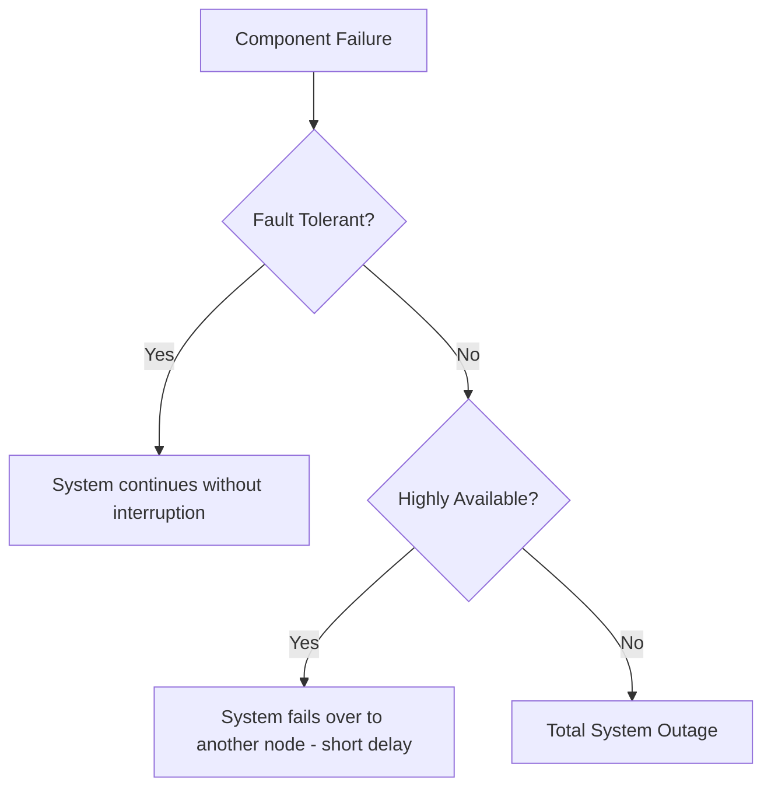

Fault tolerance is the property that enables a system to continue operating properly in the event of the failure of one or more of its components.

## Core Concepts

### 1. Graceful Degradation
Instead of a total system failure, the system disables non-essential features but remains functional.
- **Example**: If the "Recommendations" service is down on Netflix, you can still search and watch videos, but the "Because you watched..." section is hidden.

### 2. Redundancy
Having multiple versions of the same component so that if one fails, others can take over.
- **Hardware**: Dual power supplies, RAID disks.
- **Software**: Running multiple instances of a microservice.

### 3. Checkpointing and Recovery
Periodically saving the state of a system. If a failure occurs, the system can restart from the last saved checkpoint.

## Techniques for Fault Tolerance

### Replication
Data is copied across multiple nodes.
- **Synchronous**: Write to all nodes before confirming. (Slower but more fault-tolerant).
- **Asynchronous**: Write to one node, then copy to others. (Faster but risk of data loss on failure).

### Circuit Breakers
Prevents a failing service from causing a cascade of failures across the system. (More on this in the Reliability section).

## Fault Tolerance vs. High Availability

While related, they are not the same:
- **HA** focuses on avoiding downtime (Uptime).
- **Fault Tolerance** focuses on zero service interruption even if hardware fails.

## Real-world Example: Amazon S3
Amazon S3 is designed for **99.999999999% (11 nines)** of durability. It achieves this by storing data across multiple physically separate data centers within a region. Even if an entire data center is destroyed, your data remains safe.

## Key Takeaway
Expect failures. In a distributed system with thousands of servers, something is *always* failing. Design your system so that individual component failures are invisible to the end user.
