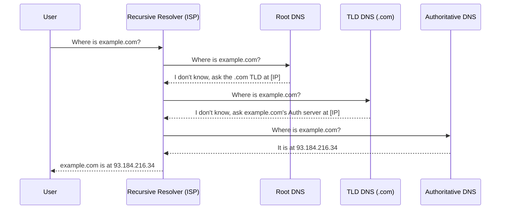

DNS is the phonebook of the Internet. It translates human-readable domain names (like `google.com`) into IP addresses (like `142.250.190.46`) that computers use to communicate.

## How DNS Works (The Journey of a Query)

When you type a URL into your browser, the following steps occur:

1. **Local Cache / Host File**: The browser checks its own cache and the OS `hosts` file.
2. **Recursive Resolver**: Usually provided by your ISP. It asks other servers on your behalf.
3. **Root Name Server**: The first step in resolving the name. It points to the **TLD (Top-Level Domain)** server (e.g., `.com`, `.org`).
4. **TLD Name Server**: Points to the **Authoritative Name Server** for the specific domain.
5. **Authoritative Name Server**: The final source of truth. Returns the IP address for the requested domain.

## DNS Caching Levels

To reduce latency and traffic, DNS results are cached at multiple levels:
- **Browser Cache**
- **OS Cache**
- **ISP Cache (Recursive Resolver)**

**TTL (Time to Live)**: Every DNS record has a TTL value that tells caches how long to store the record before asking for a fresh copy.

## Key DNS Record Types

| Type | Description | Use Case |
| :--- | :--- | :--- |
| **A** | Maps a domain to an IPv4 address. | `example.com -> 1.2.3.4` |
| **AAAA**| Maps a domain to an IPv6 address. | `example.com -> ::1` |
| **CNAME**| Alias for another domain. | `blog.example.com -> example.github.io` |
| **MX** | Mail Exchange. | Routes email to the correct server. |
| **TXT** | Text record. | Used for verification (e.g., Google Search Console). |

## DNS and High Availability

DNS can be used to balance traffic:
- **Round Robin DNS**: The authoritative server returns a list of IP addresses. The browser usually picks the first one and cycles through them.
- **Latency-based Routing**: Route users to the server closest to them.
- **Failover Routing**: If a health check fails, DNS points to a backup server.

## Key Takeaway
DNS is the entry point for almost every web request. Understanding how it caches and how to use it for routing is vital for global-scale applications.
