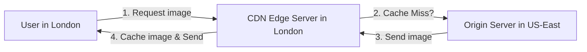

A CDN is a globally distributed network of proxy servers and data centers. Its goal is to provide high availability and performance by distributing content spatially relative to end-users.

## Why Use a CDN?

1. **Reduced Latency**: Servers are closer to the user (Edge servers), reducing the "round trip time" (RTT).
2. **Reduced Bandwidth Costs**: Offloads traffic from your origin server.
3. **Improved Scalability**: CDNs are designed to handle massive spikes in traffic.
4. **Security**: CDNs often provide DDoS protection and Web Application Firewalls (WAF).

## How a CDN Works

1. A user requests a static asset (e.g., an image).
2. The DNS routes the request to the nearest CDN Edge Server.
3. If the server has the asset cached, it returns it immediately (**Cache Hit**).
4. If not, the Edge Server fetches it from the **Origin Server**, caches it, and returns it to the user (**Cache Miss**).

## Push vs. Pull CDNs

### Pull CDN
The CDN "pulls" content from your server when a user requests it for the first time.
- **Best for**: High-traffic sites with content that doesn't change frequently.
- **Pros**: Low maintenance, automatic.

### Push CDN
Your server "pushes" content to the CDN whenever it changes.
- **Best for**: Large files or content that changes rarely (e.g., software updates).
- **Pros**: Content is always available on the edge before it's requested.

## What to Cache?

- **Static Content**: Images, CSS, JS, Video files, Fonts.
- **Dynamic Content**: Some CDNs can cache dynamic content for short periods (TTL) or use "Edge Computing" (like Cloudflare Workers) to generate responses at the edge.

## Cache Invalidation

One of the hardest problems in system design. If you update an image on your server, how do you tell the CDN to delete the old version?
1. **TTL (Time to Live)**: The CDN will automatically refresh after a certain time.
2. **Purge/Invalidation API**: Manually tell the CDN to clear a specific URL.
3. **Versioning/Hashing**: Change the filename (e.g., `script.v2.js` or `style.a8f2b3.css`). This is the most reliable method.

## Key Takeaway
For any global application, a CDN is not optional. It is the single most effective way to improve the user experience for static assets and protect your origin from traffic spikes.
