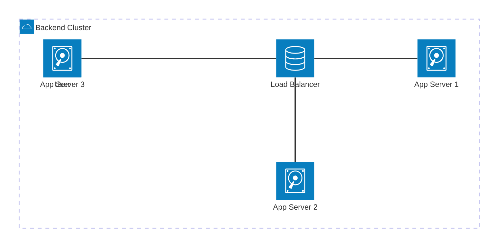

# Load Balancing

When an application becomes too popular for a single server to handle, you must scale horizontally by adding more servers. But how do the users know which server to talk to? A Load Balancer acts as the traffic cop sitting in front of your servers.

> [!TIP]
> **ELI5: The Restaurant Hostess**
> Imagine a massive restaurant with 10 waiters. 
> *   **Without a Hostess:** Customers walk in and just start yelling their orders at the first waiter they see. One waiter handles 50 tables and collapses, while the other 9 waiters stand around doing nothing.
> *   **With a Hostess (The Load Balancer):** Customers talk *only* to the Hostess at the door. The Hostess looks at the restaurant and assigns the customer to the waiter who has the fewest tables. Work is distributed perfectly.

## 1. Where do they sit?

Load balancers can be placed at multiple layers of your architecture:
1.  Between the User and your Web Servers.
2.  Between your Web Servers and an internal layer of API/App Servers.
3.  Between your internal App Servers and your Databases.

## 2. Load Balancing Algorithms

How does the Hostess decide which waiter gets the next customer?

### Round Robin
The simplest algorithm. It goes down the list sequentially: Server 1, then Server 2, then Server 3, then back to Server 1.
*   *Pros:* Extremely easy to implement.
*   *Cons:* Assumes all servers are equally powerful and all requests take the same amount of time.

### Least Connections
Routes the new request to the server with the fewest active, open connections.
*   *Pros:* Great for long-running requests (like WebSockets or heavy DB queries), preventing a single server from getting bogged down.

### Source IP Hashing
It takes the User's IP address, runs a mathematical hash function on it, and maps it to a specific server.
*   *Pros:* **Sticky Sessions**. A specific user will *always* be routed to the exact same server. This is useful if the server stores user-specific data in its local memory (though storing state locally is generally an anti-pattern in distributed systems).

## 3. Layer 4 vs. Layer 7 Load Balancing

These refer to the OSI model of networking.

### Layer 4 (Network Level)
Operates at the Transport Layer (TCP/UDP). It only looks at the IP address and the Port. 
*   It doesn't look inside the actual message. It just blindly forwards the packet.
*   *Pros:* Extremely fast and uses very little CPU.

### Layer 7 (Application Level)
Operates at the Application Layer (HTTP/HTTPS). It completely decrypts the HTTP request and looks inside it.
*   Because it reads the payload, it can make smart routing decisions. For example, routing all requests starting with `/api/images/*` to an Image Processing server, and `/api/auth/*` to an Authentication server.
*   *Pros:* Highly intelligent routing.
*   *Cons:* Slower and more CPU-intensive because it has to decrypt TLS/SSL and read the HTTP headers.
