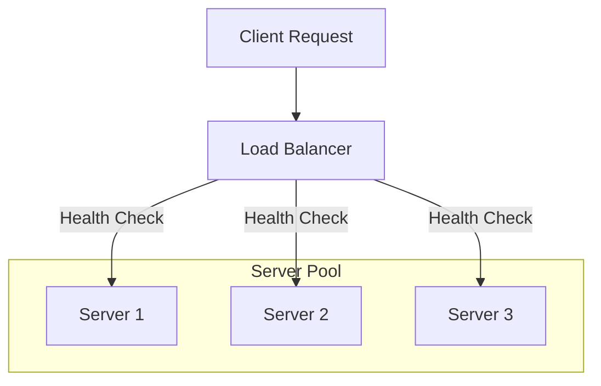

A load balancer distributes incoming network traffic across multiple servers (a "server farm" or "server pool") to ensure no single server is overwhelmed, improving both capacity and reliability.

## How it Works

## Types of Load Balancing

### 1. Layer 4 (Transport Layer)
Works at the TCP/UDP level. It makes routing decisions based on the source/destination IP and port. 
- **Pros**: Extremely fast, low overhead.
- **Cons**: Cannot see the content of the request (e.g., cannot route based on the URL).

### 2. Layer 7 (Application Layer)
Works at the HTTP/HTTPS level. It can look at the content of the request (headers, cookies, URL path).
- **Pros**: Smart routing (e.g., `/images` goes to one pool, `/api` to another). Supports SSL termination.
- **Cons**: Slower than Layer 4 due to the overhead of decrypting and parsing the request.

## Load Balancing Algorithms

| Algorithm | Description | Best For |
| :--- | :--- | :--- |
| **Round Robin** | Requests go to servers in a sequential cycle. | Servers with equal capacity. |
| **Weighted Round Robin** | Servers with higher capacity get more traffic. | Heterogeneous server clusters. |
| **Least Connections** | Sends traffic to the server with the fewest active sessions. | Long-running connections. |
| **IP Hash** | Hashes the client IP to assign it to a specific server. | Session persistence/stickiness. |

## Health Checks
The Load Balancer must know if a server is alive. It performs periodic "Health Checks":
- **L4**: Can it open a TCP connection?
- **L7**: Does the HTTP GET `/health` return a `200 OK`?

## Global Server Load Balancing (GSLB)
For global applications, load balancers can be distributed across different data centers. DNS usually handles the initial routing to the closest regional load balancer.

## Common Tools
- **Software**: Nginx, HAProxy, Envoy.
- **Cloud**: AWS ALB/NLB, Google Cloud Load Balancing, Azure Load Balancer.
- **Hardware**: F5 Big-IP, Citrix ADC (mostly legacy).

## Key Takeaway
Load balancers provide the "Single Entry Point" for your system and are the first line of defense in achieving horizontal scalability and high availability.

