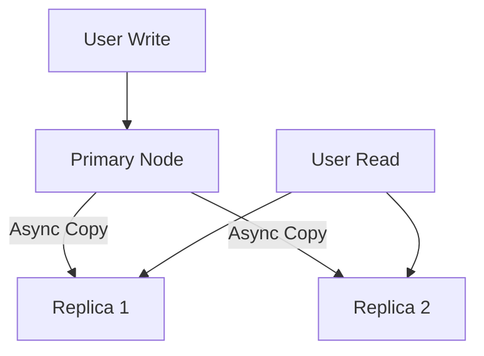
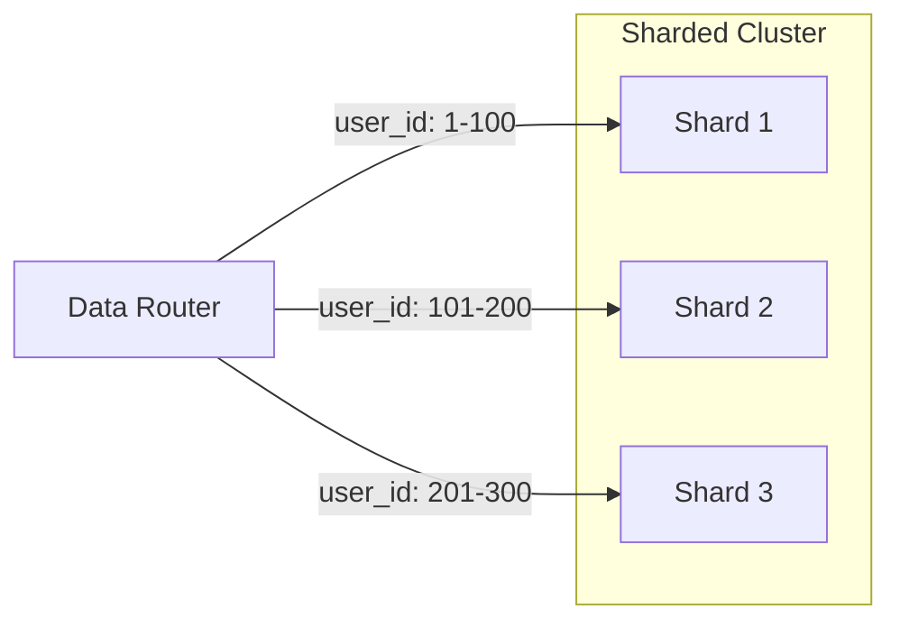

As your application grows, your database will eventually become the bottleneck. There are two fundamental ways to scale a database: **Vertical** and **Horizontal**.

## 1. Vertical Scaling (Scaling Up)
Increasing the capacity of a single machine (more CPU, RAM, or Disk).
- **Pros**: Simple, no architectural changes.
- **Cons**: Hardware limits, exponentially expensive, Downtime during upgrade.

## 2. Horizontal Scaling (Scaling Out)
Adding more machines to distribute the load. This is achieved through **Replication** and **Sharding**.

### A. Replication (Read Scalability)
Data is copied from one "Primary" node to multiple "Replica" nodes.
- **Primary**: Handles all WRITES.
- **Replicas**: Handle all READS.
- **Pros**: Increases read throughput, provides high availability (failover).
- **Cons**: Replication lag (eventual consistency).

### B. Sharding (Write Scalability)
Data is partitioned across multiple independent databases (shards). Each shard holds a subset of the data.
- **Shard Key**: The column used to determine which shard the data belongs to (e.g., `user_id`).
- **Pros**: Can handle massive datasets and high write throughput.
- **Cons**: High complexity, difficult joins across shards, "Hot Keys" problem.

## Sharding Strategies

| Strategy | Description | Pros | Cons |
| :--- | :--- | :--- | :--- |
| **Range Based** | Split by range (e.g., A-M, N-Z). | Simple to implement. | Can lead to uneven load (Hotspots). |
| **Hash Based** | `hash(key) % total_shards`. | Even distribution of data. | Resharding is very difficult. |
| **Directory Based** | A lookup table maps keys to shards. | Flexible, easy to move data. | Lookup table is a SPOF and bottleneck. |

## Key Takeaway
Start with Replication for read-heavy apps. Only move to Sharding when your write volume or dataset size exceeds the capacity of a single large machine.

