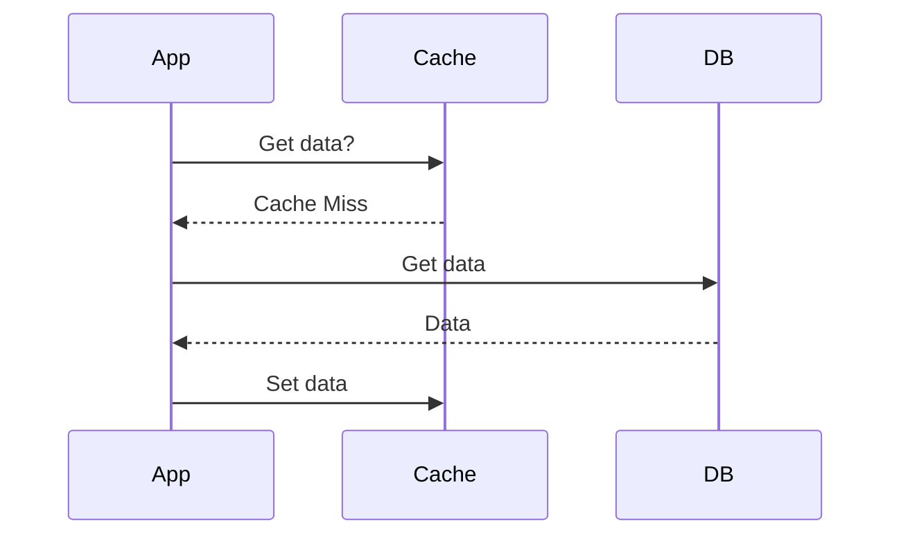
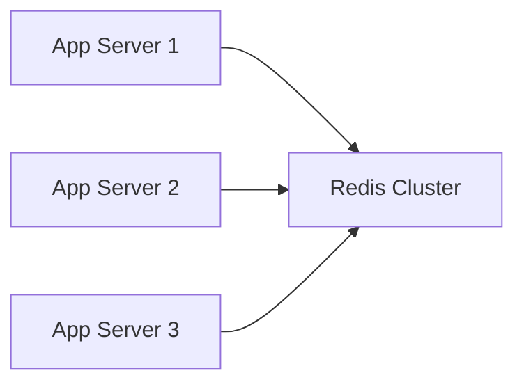

Caching is the process of storing data in a high-speed memory layer (RAM) so that future requests for that data can be served faster than fetching it from its primary storage (Database or API).

## Why Cache?
1. **Performance**: Reduces read latency.
2. **Scalability**: Reduces load on the primary database.
3. **Availability**: Can serve stale data if the origin is down.

## Caching Layers
- **Client Side**: Browser cache.
- **Network Side**: CDN.
- **Application Side**: In-memory (Local) or Distributed Cache.
- **Database Side**: Database internal cache.

## Common Caching Patterns

### 1. Cache-Aside (Lazy Loading)
The application handles the logic for checking the cache and updating the database.
- **Read**: App checks cache. If miss, it fetches from DB, then stores in cache.
- **Write**: App writes directly to DB.
- **Pros**: Only requested data is cached. Resilience (if cache fails, DB still works).
- **Cons**: Cache miss penalty (double hop). Data can become stale.

### 2. Write-Through
The application writes to the cache, and the cache synchronously writes to the database.
- **Pros**: Data in cache is never stale. Reads are always fast.
- **Cons**: Write latency is higher (must wait for both).

### 3. Write-Back (Write-Behind)
The application writes to the cache, and the cache *eventually* writes to the database in the background.
- **Pros**: Ultra-fast writes.
- **Cons**: Risk of data loss if the cache fails before writing to the database.

## Distributed Cache
A cache that spans multiple servers. It is used when the data size exceeds a single machine's RAM or when multiple app servers need a shared state.
- **Example**: Redis Cluster.

## When to use what?

| Strategy | Speed | Consistency | Reliability |
| :--- | :--- | :--- | :--- |
| **Cache-Aside** | High | Low | High |
| **Write-Through** | Medium | High | High |
| **Write-Back** | Very High | Low | Low |

## Key Takeaway
Cache-Aside is the most common pattern for general web applications. Use Write-Back only for high-performance write scenarios where data loss is acceptable (e.g., logging, metrics).
