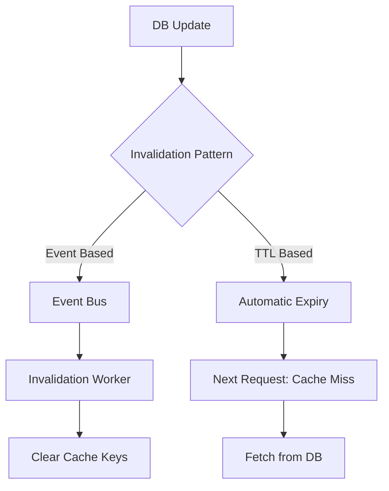

"There are only two hard things in Computer Science: cache invalidation and naming things." — Phil Karlton.

Cache invalidation is the process of declaring cached data as invalid so it can be replaced with the most current version from the primary storage.

## Why is it hard?
If you update data in the database but the old version stays in the cache, users will see inconsistent or wrong data. However, if you invalidate too often, your performance drops because every request hits the database.

## Invalidation Strategies

### 1. TTL (Time to Live)
Each cache entry has an expiration time. After the TTL expires, the entry is automatically removed.
- **Pros**: Simplest to implement. Automatically cleans up "garbage" data.
- **Cons**: Users will see stale data until the TTL expires. Sudden spikes in DB load when many keys expire at once (Cache Stampede).

### 2. Manual Invalidation (Purge)
The application explicitly removes or updates the cache entry when the database is updated.
- **Best For**: Systems requiring high consistency.

### 3. Write-Through / Write-Back
As discussed in Caching Strategies, these patterns handle invalidation within the write process itself.

## Advanced Techniques

### Cache Tags (Surrogate Keys)
Grouping multiple cache entries under a single "tag". If a resource changes, you invalidate the tag, which clears all related entries.
- **Example**: Inverting all pages related to an "Author" when the author's profile changes.

### Versioning (Cache Busting)
Adding a version number or hash to the asset path.
- **Example**: `/static/style.v1.css` becomes `/static/style.v2.css`. This forces the client/CDN to fetch the new version.

## Common Failures

| Issue | Description | Mitigation |
| :--- | :--- | :--- |
| **Thundering Herd** | Many requests hit the same expired key simultaneously, overwhelming the DB. | Use locking or "soft TTL" (serve stale while background re-fetch). |
| **Cache Penetration** | Requests for keys that don't exist in DB reach the DB every time. | Cache "Null" values or use Bloom Filters. |
| **Cache Stampede** | Same as thundering herd but for many keys at once. | Stagger TTLs (add "jitter"). |

## Invalidation Diagram

## Key Takeaway
Perfect consistency in a distributed cache is nearly impossible. Aim for "Eventual Consistency" with small TTLs for most cases. For mission-critical data, use explicit versioning or avoid caching altogether.
