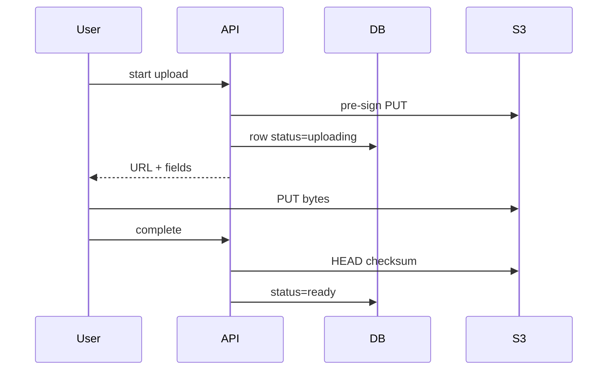

**Blob / object storage** (S3, GCS, Azure Blob) stores **unstructured bytes** addressed by a key inside a bucket: images, videos, backups, dumps, static assets. It is not a POSIX disk. There is no `seek` and patch a byte; you replace the object.

Putting 50MB videos in Postgres is how backups take all night and the primary's RAM dies. Putting them in S3 is how every photo app on earth works.

> [!TIP]
> **ELI5: The warehouse vs the cash register**
> The database is a cash register drawer: small, structured, you query it. The warehouse (S3) holds the sofas. You keep a *ticket* in the register ("aisle 9, sofa #abc") and send the customer to the warehouse with a temporary pass (**pre-signed URL**). You do not stuff sofas in the drawer.

## 1. Why not the database

| | DB BLOB column | Object store |
| :--- | :--- | :--- |
| Size | Grows backups, WAL, memory | Designed for TB–PB |
| Cost | DB-class disks | Cheap bulk storage |
| Serving | Through your API | HTTP(S) from the edge / CDN |
| Partial update | Possible | New object (or multipart) |
| Query | SQL | List/get by key; search is your DB |

**Durability** is the product: S3-class stores replicate across AZs. "11 nines" is **durability** (odds of losing the object), not **availability** (can I GET it this second). Interviews mix these up.

## 2. Metadata lives in *your* database

The object is `s3://acme-prod/uploads/u_9/img_31.jpg`. Postgres stores:

- `id`, `user_id`, `content_type`, `bytes`, `sha256`
- `bucket`, `key`, `status` (uploading / ready)
- `created_at`

Never treat the filename as the only source of truth. Users lie; keys collide; you need access control.

## 3. Pre-signed URLs (do not proxy 2GB through Node)

If the API `recv`s the file and then `put`s to S3, **your** network and memory are the bottleneck, and timeouts become your problem.

**Pre-signed URL:** API uses IAM to mint a short-lived URL that allows `PUT` or `GET` for that key. The browser talks to S3 (or CloudFront) directly. API never sees the bytes.

Rules:

- Scope the key: `uploads/${userId}/${uuid}` — not `uploads/*` for ten minutes.
- Short expiry (minutes for PUT, minutes-to-hours for GET).
- On complete, **verify** size/content-type/checksum with `HEAD` before marking ready. Otherwise people upload a 20GB joke to your bill.
- For downloads of private objects, pre-sign GET or send through CloudFront with signed cookies. Do not make the bucket public "for convenience."

## 4. Lifecycle, classes, and CDN

Hot images: **standard** class, in front of a **CDN**. Old logs: transition to **infrequent access**, then **glacier/archive** (cheap, hours to restore). Lifecycle rules are how you do not pay standard rates for 7-year-old dumps.

Multipart upload for large files (parallel parts, retry one part). Abort incomplete multipart or you pay for abandoned parts.

Versioning: optional safety against `DeleteObject` disasters; it is not free.

## 5. Failure modes

- **Public bucket** with customer data. Default: block public access.
- **Confused deputy:** a pre-sign that allows overwrite of another user's key.
- **Eventual list:** listing a bucket of millions of keys is not your user search. Use the DB.
- **Thundering GET** on a new object: CDN cache miss stampede — still better than one Postgres.

> [!WARNING]
> Access control is IAM + pre-sign + your DB row. An object URL that is guessable (`/users/1/avatar.jpg` in a public bucket) *is* the security model. Assume attackers iterate ids.

## What to remember

- Bytes in object storage; metadata and permissions in a database.
- Users upload/download with pre-signed URLs; the API authorizes and records.
- Durability ≠ availability. Replication is for loss, CDNs are for speed.
- Never public buckets for private data; never SQL as a video store.
