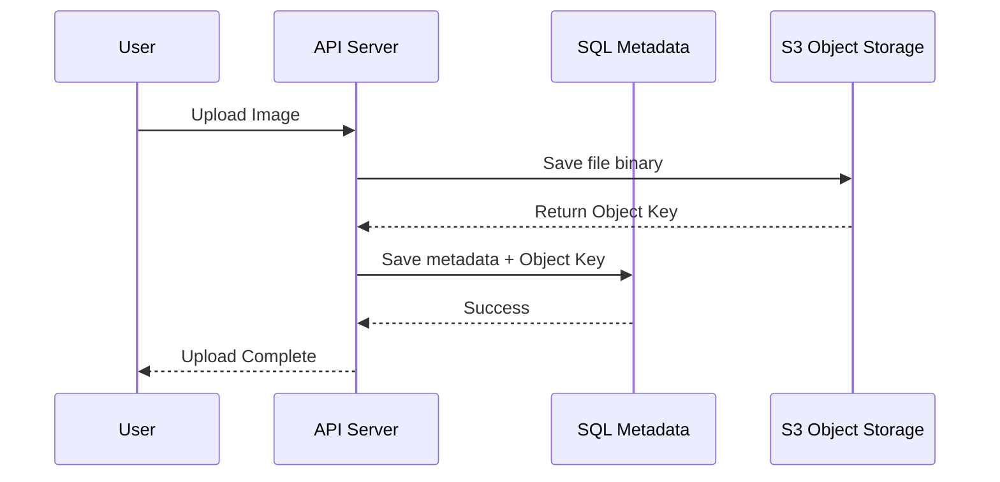

Blob (Binary Large Object) Storage is designed to store massive amounts of unstructured data such as images, videos, audio files, log files, and backups.

## Why not storage Blobs in a Database?
While databases can store binary data (BLOB type), it is generally a bad practice for large files because:
1. **Performance**: Large binaries significantly increase database backup time and memory usage.
2. **Cost**: Database storage is much more expensive than specialized Object Storage.
3. **Complexity**: Scaling a database to petabytes of images is far harder than using an Object Storage service.

## Key Features of Blob Storage

- **Store/Retrieve**: Objects are stored in "buckets" and identified by a unique key (usually a path/filename).
- **Infinite Scalability**: Can store millions of gigabytes of data.
- **High Durability**: Often guarantees "11 nines" (99.999999999%) of storage durability via replication.
- **HTTP Access**: Files can be served directly via HTTP/S URLs.

## Common Metadata Strategy

In a typical system, you store the **file** in Blob Storage and its **metadata** (filename, size, user_id, URL) in a SQL or NoSQL database.

## Optimizing Downloads (Pre-signed URLs)

To avoid your app server becoming a bottleneck for file downloads, you can generate "Pre-signed URLs". These are temporary, secure links that allow the user to download the file directly from the Blob Storage.

## Lifecycle Management
Blob storage allows you to automatically transition data to cheaper storage classes over time:
- **Standard**: Frequently accessed (Expensive but fast).
- **Cool**: Infrequently accessed (Cheaper).
- **Glacier**: Archival only (Dirt cheap, hours to retrieve).

## Key Takeaway
For any system handling media, backups, or large documents, Blob Storage is the standard. Services like **AWS S3**, **Google Cloud Storage**, and **Azure Blob Storage** are the industry leaders.
