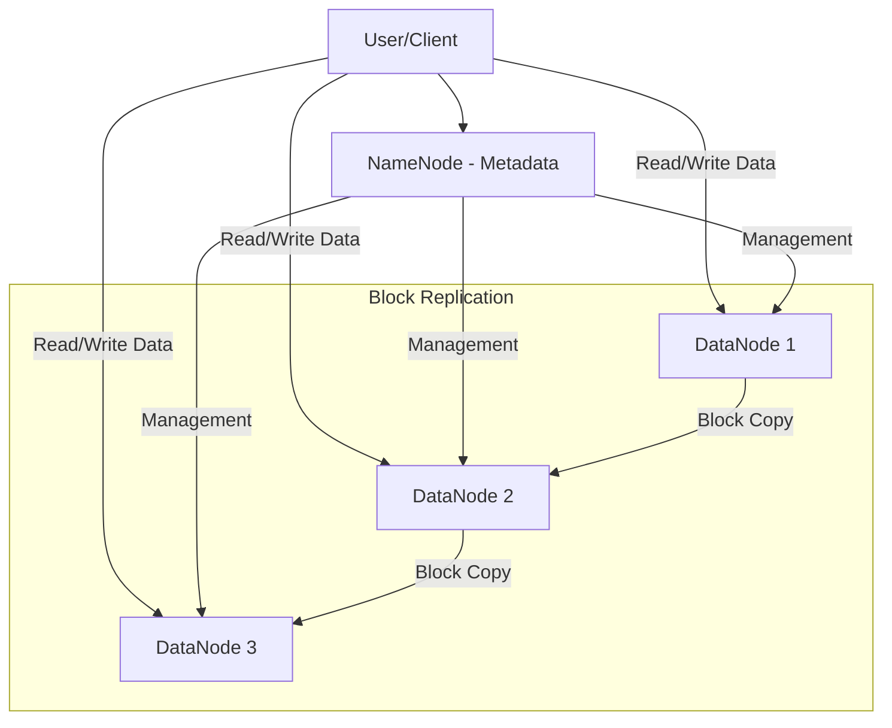

A Distributed File System (DFS) is a file system that allows many users to access and share files stored on multiple, physically separated computer servers as if they were stored on a local machine.

## How it differs from Blob Storage
- **Blob Storage**: Key-Value access (Flat). No hierarchical structure (usually). No atomic renames/appends. Best for immutable objects.
- **DFS**: Supports traditional file system hierarchy (Folders/Files). Supports random access, appends, and specialized read/write operations. Best for massive data processing (Big Data).

## Core Concepts

### 1. Metadata vs. Data
- **NameNode (Metadata)**: Stores the directory tree and the location of file blocks.
- **DataNodes (Data)**: Store the actual chunks (blocks) of the file.

### 2. Block-based Storage
Large files are split into blocks (e.g., 128MB or 256MB) and distributed across many nodes. This allows for massive parallel processing.

### 3. Replication & Fault Tolerance
Each block is replicated (usually 3 times) across different racks of servers. If one node fails, the data remains available.

## Popular Distributed File Systems

### HDFS (Hadoop Distributed File System)
The cornerstone of the Hadoop ecosystem. Designed to run on commodity hardware and provide very high throughput.
- **Write Once, Read Many**: Optimized for batch processing rather than low-latency random writes.

### GFS (Google File System)
The inspiration for HDFS. It was designed to handle Google's massive data processing needs (e.g., web indexing).

## DFS Architecture

## Comparisons

| Feature | Local FS | Distributed FS | Blob Storage |
| :--- | :--- | :--- | :--- |
| **Scale** | GB/TB | PB/EB | PB/EB |
| **Access** | Local Disk | Network Protocol | REST/HTTP |
| **Hierarchical** | Yes | Yes | No (Flat/Vrtual) |
| **Parallelism** | Low | High (Block based) | Medium |

## Key Takeaway
Use Distributed File Systems when you need to store and process "Big Data" (petabytes of logs or data for machine learning). For most standard applications, Blob Storage is simpler and more cost-effective.
