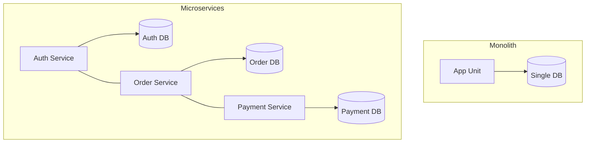

Choosing the overall architecture of your system is a fundamental decision. For decades, the **Monolith** was the standard, but **Microservices** have become the preferred choice for large-scale, enterprise applications.

## 1. Monolithic Architecture

In a monolith, all components of the application (UI, Business Logic, Data Access) are bundled together into a single unit and deployed as one.

### Characteristics
- **Shared Codebase**: One repository for everything.
- **Single Deployment**: Update one line of code, redeploy the entire app.
- **Simple to Test**: Easy to run end-to-end tests locally.
- **Scaling**: Must scale the *entire* app, even if only one module is slow.

### Pros
- Simpler development and deployment initially.
- No network latency between components.
- Easier to maintain data consistency.

### Cons
- **Coupling**: Changes in one module can break another.
- **Barrier to Innovation**: Hard to adopt new technologies (you are "locked in" to the stack).
- **Scale Bottlenecks**: One slow component slows down the whole deployment process.

---

## 2. Microservices Architecture

In microservices, the application is split into small, independent services that communicate over a network (usually via REST, gRPC, or Message Queues). Each service handles a specific business capability.

### Characteristics
- **Independence**: Each service has its own codebase, database, and deployment cycle.
- **Loose Coupling**: Services don't depend on the internal implementation of others.
- **Polyglot**: You can use Go for high-performance services and Python for data services in the same app.

### Pros
- **Fault Isolation**: If the "Recommendations" service fails, users can still check out.
- **Granular Scaling**: Scale only the "Search" service during a traffic spike.
- **Organizational Alignment**: Large teams can work on different services without stepping on each other's toes.

### Cons
- **Operational Complexity**: Requires advanced observability (logging, tracing) and CI/CD.
- **Network Latency**: Inter-service communication is slower than in-memory calls.
- **Data Consistency**: Harder to maintain (requires Sagas or Two-Phase Commits).

---

## Comparison Diagram

## When to Choose Which?

| Feature | Monolith | Microservices |
| :--- | :--- | :--- |
| **Complexity** | Low | High |
| **Scalability** | Vertical / Limited Horizontal | High (Elastic) |
| **Tech Stack** | Single | Multiple (Polyglot) |
| **Deployment** | All or nothing | Independent |
| **Team Size** | Small (1-2 teams) | Large (10+ teams) |

## Key Takeaway
**Start with a Monolith.** Most "Microservice" success stories (like Netflix or Uber) started as monoliths and pivoted when they reached massive scale. Don't pay the "Microservices Tax" (complexity) until you actually have the problems that microservices solve.
