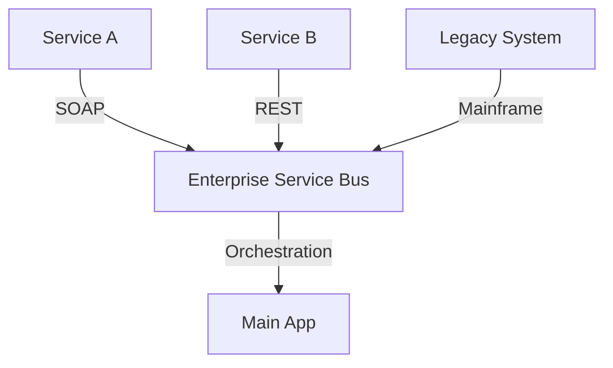

Service-Oriented Architecture (SOA) is an architectural style in which applications are built as a set of services that communicate with each other over a network. It is the predecessor and foundation of modern **Microservices**.

## SOA vs. Microservices

While they share the idea of "splitting an app into services," they have different philosophies:

| Feature | SOA | Microservices |
| :--- | :--- | :--- |
| **Communication** | Often uses an **ESB** (Enterprise Service Bus). | Direct (Lightweight REST/gRPC). |
| **Granularity** | Coarse-grained (e.g., "Accounting Service"). | Fine-grained (e.g., "Ledger Service"). |
| **Sharing** | Focuses on reusability and shared components. | Focuses on independence and isolation. |
| **Database** | Usually shared across many services. | One database per service (dedicated). |

## Core Component: The Enterprise Service Bus (ESB)

In traditional SOA, all services connect to a central **ESB**. The ESB handles:
- **Routing**: Where should this request go?
- **Transformation**: Convert XML to JSON or vice versa.
- **Protocol Conversion**: Convert SOAP to MQ.

## Why SOA fell out of favor?

1. **Complexity**: The ESB became a "monolith" of its own. It was a single point of failure and hard to maintain.
2. **Speed**: Heavy protocols like SOAP and XML were slow compared to modern HTTP/JSON.
3. **Agility**: Changing the ESB logic often required cross-team coordination, slowing down deployment.

## When is SOA still used?

- **Enterprise Integration**: In large companies with many legacy systems (banks, insurance) that need to talk to modern web apps.
- **Hybrid Systems**: Where you need a bridge between different departments with completely different tech stacks.

## Key Takeaway
SOA is about **integration** across an enterprise. Microservices is about **decoupling** for developer agility and scale. Most modern start-ups use microservices, but you will often encounter SOA in the "Enterprise" world.
