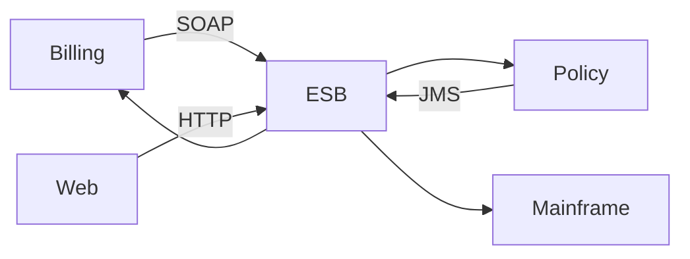

**SOA** (Service-Oriented Architecture) means the business is built from **network-callable services** with documented contracts, not one ball of code. That sentence also describes microservices. SOA is the *enterprise 2000s* version of the idea: fewer, larger services, lots of shared infrastructure, and usually a central **ESB** (Enterprise Service Bus).

You will meet SOA in banks, insurance, and anywhere SOAP still pays the bills. You will meet its lessons in every microservices debate.

> [!TIP]
> **ELI5: Department store vs food hall**
> SOA is a department store: big departments (Accounting, Inventory), a central PA system and freight elevator (**ESB**) that every department must use to talk. Microservices is a food hall: tiny stalls, they talk over the counter (HTTP/gRPC), they buy their own ingredients (databases). The elevator in the department store became a queue for the whole building.

## 1. The shape of SOA

Typical pieces:

- **Services** at *domain* granularity: "Customer," "Billing," "Policy" — not "UpdateEmailHandler."
- **Contracts** that were often **XML/SOAP/WSDL**, versioned like enterprise law.
- **Shared platforms:** one directory, one security stack, one **canonical data model**.
- **ESB:** routing, transform XML→something, orchestrate "when order placed, call A then B."

The ESB was sold as reuse: new channels (web, branch, partner) plug into the bus, not into twelve systems. That part was real.

## 2. SOA vs microservices (the table that matters)

| | SOA (classic) | Microservices |
| :--- | :--- | :--- |
| Size | Coarse (a department) | Fine (one capability) |
| Talk | ESB, SOAP, messaging | Direct REST/gRPC, maybe a mesh |
| Data | Shared DBs common | DB per service as the *ideal* |
| Reuse | Shared libraries and canonical model | Duplicate a little; do not couple |
| Change | Bus team + governance board | Team ships its service |
| Failure | Bus down → campus down | One service down → that feature down |

Microservices kept "split the app" and threw away "everything must hop a smart bus." Dumb pipes, smart endpoints.

## 3. Why the ESB soured

1. **The bus became the monolith.** All transforms and orchestrations lived there. Releases of the bus were all-hands.
2. **Single point of failure and scale.** Everything's p99 included the ESB's p99.
3. **Canonical model freeze.** A shared `Customer` XML type that every team must agree on is a distributed monolith in schema form.
4. **SOAP/XML weight.** Fine for some enterprises. Painful compared to JSON/HTTP or protobuf for internet-scale product teams.

> [!WARNING]
> Replacing an ESB with a "smart" service mesh that still centralizes *business* orchestration is the same shape. Meshes should move packets and policy (retries, mTLS), not your order-state machine.

## 4. When SOA (the pattern) is still the right call

- **Many legacy systems** (mainframe + SAP + a Java app) that will not grow their own HTTP APIs this year. A bus or integration layer is honest.
- **Strong compliance** that wants one audited hop for "who called whom."
- **Org structure** that is already departmental; fighting it with 200 nano-services is a fantasy.

A modern version looks like an **integration platform** or event backbone *at the edges*, while *new* product code is services with their own data. That hybrid is how actual banks migrate, not "rewrite everything as Kubernetes."

## 5. What to say in an interview

"SOA and microservices both decompose a system into services. SOA optimized for **enterprise integration and reuse**, often with an ESB and shared models. Microservices optimize for **independent deploy and failure isolation**, with lighter direct calls and data ownership. The ESB's lesson is: a smart central bus becomes the bottleneck, so we keep pipes dumb."

If they ask drawbacks of microservices, that is the [monolith vs microservices](./016-monolith-vs-microservices) page — distributed transactions, ops cost, chatty networks.

## What to remember

- SOA = services + contracts + (historically) a smart bus.
- Microservices = smaller services + dumb pipes + independent data *as a goal*.
- The ESB failed as a *business logic* home, not as "messaging is bad."
- Integration-heavy enterprises still need an integration layer; do not relabel it microservices and stop thinking.
