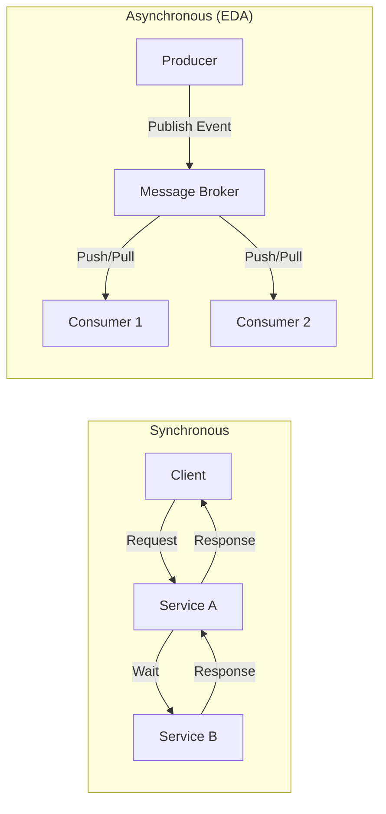

Event-Driven Architecture (EDA) is a design pattern where the flow of the program is determined by **events**—significant changes in state (e.g., "Order Placed", "User Registered"). 

## Core Components

1. **Event Producer**: The component that detects a state change and sends an event. (e.g., The Checkout service).
2. **Event Channel (Broker)**: The middleware that transmits the event. (e.g., Kafka, RabbitMQ).
3. **Event Consumer**: The component that listens for events and reacts. (e.g., The Shipping service).

## Request-Response vs. Event-Driven

- **Request-Response (Synchronous)**: "I need this data NOW." (Wait for result).
- **Event-Driven (Asynchronous)**: "This happened. Do what you want with this info." (Don't wait).

## Benefits of EDA

- **Loose Coupling**: The producer doesn't know who the consumers are. You can add new consumers (e.g., "Analytics Service") without changing the producer.
- **Improved Scalability**: Consumers can process events at their own pace. Great for handling traffic spikes.
- **Responsiveness**: The user doesn't have to wait for background tasks (like sending an email) to finish.

## Challenges

- **Complexity**: Harder to debug and trace the flow of a single request.
- **Data Consistency**: Requires handling "Eventual Consistency".
- **Ordering**: Distributed systems often struggle with ensuring events are processed in the *exact* order they occurred.

## Real-world Example: E-commerce Order
1. **Order Service** publishes "OrderPlaced" event.
2. **Inventory Service** consumes it and reserves stock.
3. **Payment Service** consumes it and charges the card.
4. **Email Service** consumes it and sends a receipt.

## Key Takeaway
Use EDA when you need to decouple services or handle long-running background tasks. It is the secret to building highly scalable, reactive systems used by companies like LinkedIn, Uber, and Netflix.
