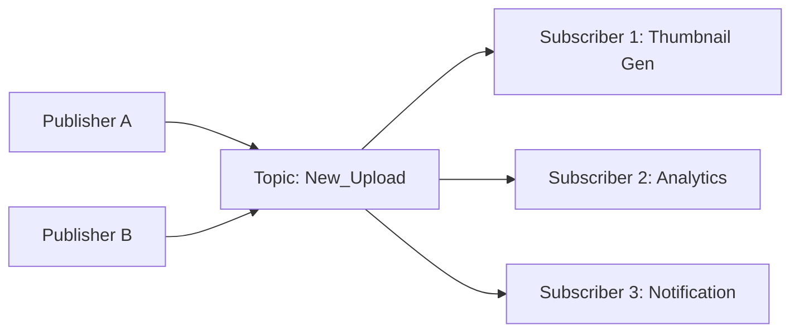

Pub/Sub (Publisher-Subscriber) is a messaging pattern where senders (**Publishers**) do not program the messages to be sent directly to specific receivers (**Subscribers** or Consumers). Instead, published messages are characterized into categories (Topics) without knowledge of which subscribers, if any, there may be.

## How it Works

1. **Publisher**: Sends a message to a **Topic**.
2. **Broker**: Receives the message and maintains a list of subscribers for that topic.
3. **Subscriber**: Receives a copy of any message published to the topic(s) they are subscribed to.

## Key Characteristics

- **Fan-out**: One message can be delivered to multiple subscribers simultaneously.
- **Decoupling**: Publishers and subscribers can operate independently.
- **Asynchronous**: Publishers don't wait for subscribers to finish processing.

## Pub/Sub vs. Message Queues

| Feature | Pub/Sub | Message Queue (Point-to-Point) |
| :--- | :--- | :--- |
| **Delivery** | One-to-Many (Fan-out) | One-to-One |
| **Persistence** | Often transient (unless using Kafka) | Usually persistent until consumed |
| **Use Case** | Broadcasting events to many systems | Distributing heavy tasks to workers |

## Common Technologies

- **Redis Pub/Sub**: Fast, in-memory, no persistence (Fire and forget).
- **Google Cloud Pub/Sub**: Managed, global, highly scalable.
- **Amazon SNS**: Simple Notification Service.
- **Apache Kafka**: Used for Pub/Sub with data persistence (Log-based).

## Real-world Example: Social Media
When a celebrity posts a tweet, the "Tweet Service" publishes an event to a topic.
- One subscriber handles the celebrity's followers' feeds.
- Another subscriber handles mention notifications.
- Another subscriber sends an event to an analytics engine.

## Key Takeaway
Use Pub/Sub when you have one event that needs to trigger multiple actions across different services. It is the foundation of modern multi-service reactive architectures.
