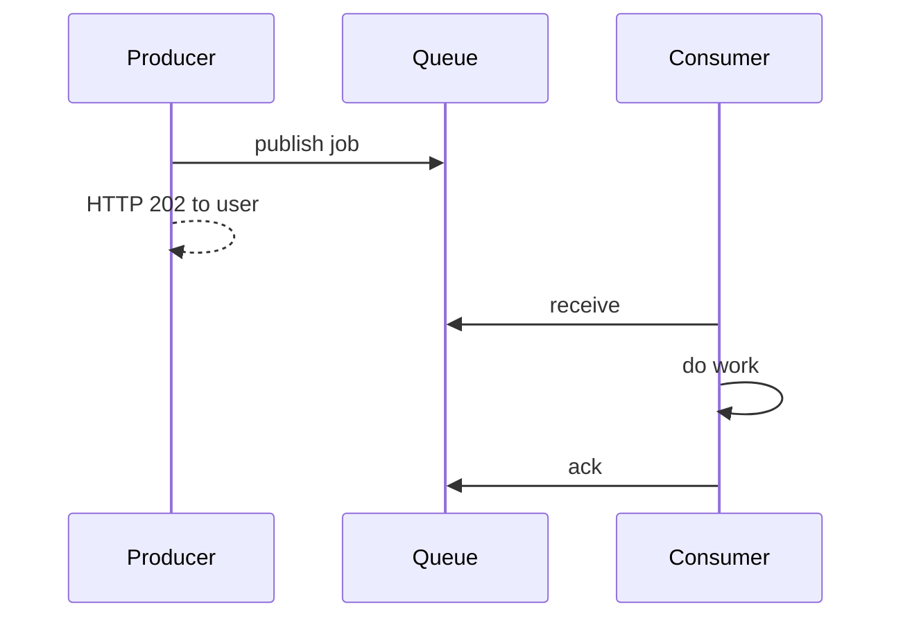

A **message queue** lets one service hand work to another **without waiting** for that work to finish. The producer writes a message and moves on. A consumer pulls it later, does the job, and **acks**. If the consumer dies mid-job, the message returns for someone else.

That is how you send email without blocking HTTP, absorb a traffic spike, and keep checkout up when the printer in the warehouse is offline.

> [!TIP]
> **ELI5: The ticket spike**
> The kitchen (consumer) cooks 10 plates a minute. The dining room (producer) just took 200 orders. Without a spike, tickets pile on the pass and cooks panic. A **queue** is the ticket rail: orders wait in order, cooks pull the next one, if a plate is dropped the ticket goes back on the rail (**nack / retry**). If a ticket is unreadable, it goes in a bin for the manager (**DLQ**), not back on the rail forever.

## 1. The moving parts

- **Producer:** checkout service, API, cron.
- **Broker:** SQS, RabbitMQ, Redis streams, NATS, etc.
- **Consumer / worker:** a process whose only job is this work.
- **Ack:** "I finished; you may delete." **Visibility timeout / nack:** "I failed or died; give it to someone else."

Until ack, the message is **in flight**, not gone. At-least-once delivery is the default: you **will** see duplicates. Consumers must be **idempotent** (see [idempotency](./027-idempotency)).

## 2. What a queue is for

| Problem | Queue does this |
| :--- | :--- |
| HTTP must not wait on SMTP | Return 202, worker sends mail |
| 10k uploads, 50 transcoders | Buffer, scale workers independently |
| Downstream 500s | Retry with backoff instead of failing the user |
| Fan-out to many teams | Usually **pub/sub** or a log, not a single queue |

**Load leveling:** producer peaks, consumer is flat. The queue's depth is a metric: growing depth means you need more consumers or a faster consumer.

## 3. Queue vs Kafka (do not mix the words)

A **queue** (RabbitMQ, SQS classic): competing consumers **share** work. Each message is processed by **one** worker, then deleted (or archived). Good for **tasks**.

A **log** (Kafka, Kinesis): messages are **retained** for a time. Many consumer **groups** each have their own offset. Good for **events** many teams must read, replay, and audit.

| | SQS / RabbitMQ | Kafka |
| :--- | :--- | :--- |
| Model | Task queue | Distributed log |
| After consume | Gone (or hidden) | Still on disk until retention |
| Fan-out | Extra queues / SNS | Extra consumer groups |
| Ordering | Per queue or FIFO (slower) | Per partition |
| Replay | Painful | Native (reset offset) |

Use a queue for "resize this image." Use a log for "every order event, forever-ish, for search *and* analytics *and* fraud."

## 4. Failure: retries, poison, DLQ

Workers fail. Networks fail. Messages can be **poison** (bad JSON that panics the worker).

Without a **max receive count**, a poison message is received, crashes the worker, becomes visible, repeats — a hot loop that blocks the queue.

**Dead letter queue:** after N failures, move the message aside. Humans or a script inspect it. The main rail keeps moving.

Also decide:

- **Retry/backoff** so a down dependency is not hammered.
- **Idempotency keys** so a double ack-loss does not double-charge.
- **Ordering:** if you need it, you pay (FIFO queues, or partition by `userId` in Kafka). Total global order does not scale.

> [!WARNING]
> A visibility timeout shorter than your job runtime means another worker picks up a message that is still running. Two workers charge the card. Set timeout > p99 runtime, or heartbeat/extend it.

## 5. A design you can draw

User uploads a video:

1. API writes object to S3, writes `video_id` to SQL as `pending`, enqueues `{video_id}`.
2. Returns 202.
3. Worker transcodes, writes outputs, updates SQL to `ready`, acks.
4. Failures go to DLQ; status stays `pending` for a retry.

The user never waited on ffmpeg.

## What to remember

- Queue = async work + buffer + at-least-once. Ack is the commit.
- Duplicate delivery is normal; idempotency is required.
- DLQ is how you stop poison messages from stalling the world.
- Kafka is a replayable log for many consumers; SQS/Rabbit are task queues. Pick on purpose.
