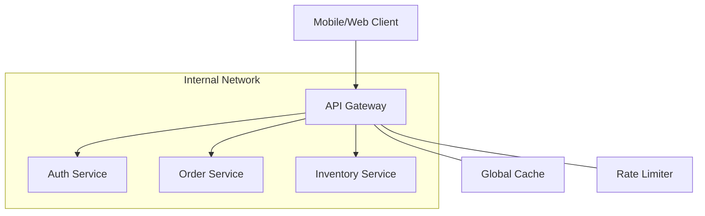

An API Gateway is a server that acts as an API front-end, receives API requests, enforces throttling and security policies, passes requests to the back-end service, and then passes the response back to the requester.

## Why Use an API Gateway?
In a microservices architecture, a client (like a mobile app) might need to talk to dozens of services. Instead of the client managing these connections, it talks to a single **API Gateway**.

## Core Responsibilities

1. **Routing**: Directing requests to the appropriate microservice based on the URL path.
2. **Authentication & Authorization**: Validating tokens (JWT) before the request hits the internal network.
3. **Rate Limiting**: Preventing abuse by limiting the number of requests a user can make per second.
4. **Load Balancing**: Distributing requests among multiple instances of a service.
5. **Protocol Translation**: Converting between different protocols (e.g., external REST to internal gRPC).
6. **BFF (Backend for Frontend)**: Aggregating multiple service responses into a single JSON for the mobile app to reduce network calls.

## Architecture Diagram

## Comparison: API Gateway vs. Load Balancer

| Feature | Load Balancer | API Gateway |
| :--- | :--- | :--- |
| **Focus** | Traffic distribution / Availability | API Management / Security / Aggregation |
| **Layer** | Layer 4 or Layer 7 | Layer 7 (Application) |
| **Visibility** | Usually invisible to the logic | Has knowledge of APIs and Users |

## Popular Tools
- **Cloud Native**: AWS API Gateway, Azure API Management, Kong.
- **Open Source**: Nginx (with logic), Tyk, KrakenD.
- **Service Mesh**: Istio, Linkerd (handle some gateway-like duties inside the cluster).

## Challenges
- **Single Point of Failure**: If the gateway goes down, the whole app is down.
- **Latency**: Every request adds one more network hop.
- **Bottleneck**: If not scaled properly, it can slow down all services.

## Key Takeaway
For microservices, an API Gateway is essential. It provides a standard "Front Door" that simplifies client-side code and centralizes cross-cutting concerns like security and monitoring.
