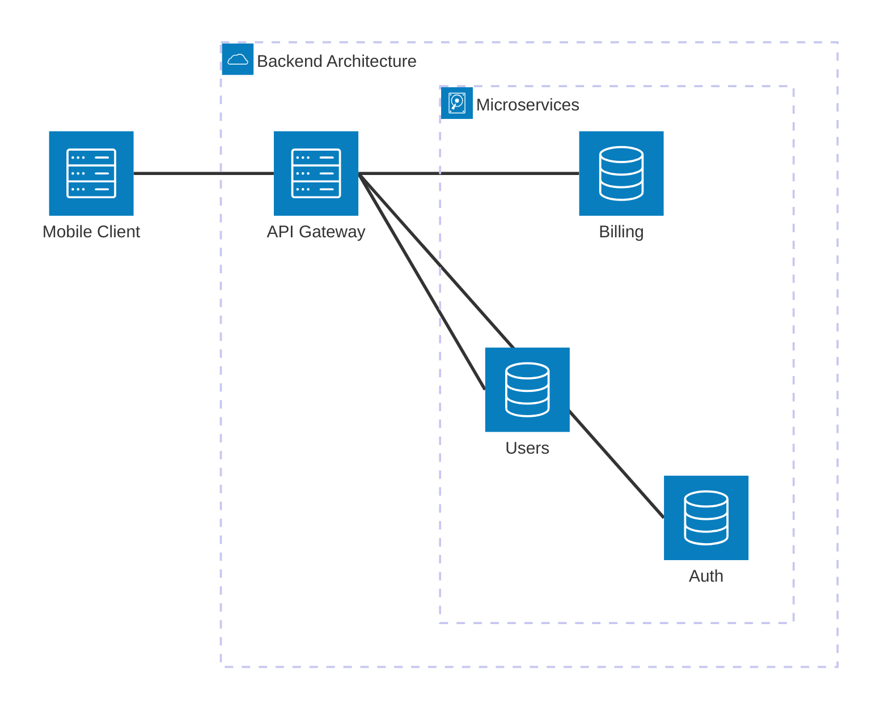

In a microservices architecture, a single frontend application (like a mobile app) might need data from 5 different backend services to render a single page. If the mobile app communicates directly with all 5 microservices, chaos ensues.

An API Gateway solves this by acting as the single, unified entry point for all external traffic.

> [!TIP]
> **ELI5: The Hotel Concierge**
> Imagine walking into a massive luxury hotel and wanting to book a massage, order room service, and arrange a taxi.
> *   **Without a Gateway:** You have to physically walk to the Spa on the 3rd floor, then the Kitchen in the basement, then the Valet out front. You have to know where they all are.
> *   **With a Gateway (The Concierge):** You walk up to the Concierge desk at the front door. You give them your list. The Concierge coordinates with the Spa, Kitchen, and Valet behind the scenes, and hands you all your confirmations at once.

## 1. Core Responsibilities

An API Gateway does much more than just forward requests. It centralizes cross-cutting concerns that you otherwise would have to build into every single microservice.

### 1. Request Routing (Reverse Proxy)
It maps external URLs to internal services.
*   Traffic to `api.example.com/billing/*` is secretly routed to internal IP `10.0.0.5:8080`.

### 2. Authentication & Authorization
Instead of building JWT verification into every single microservice, the API Gateway verifies the token once. If it's invalid, it rejects the request before it ever touches your internal network.

### 3. Rate Limiting & Throttling
Protects your internal services from DDoS attacks or runaway scripts. The gateway can restrict users to "100 requests per minute" globally.

### 4. API Composition (BFF)
BFF stands for "Backend For Frontend". If the mobile app needs data from the User service and the Billing service, it makes *one* request to the Gateway. The Gateway makes the two internal requests, combines the JSON responses, and returns one optimized payload to the mobile app, saving bandwidth and battery life.

## 2. Potential Drawbacks

While essential for large systems, an API Gateway introduces risks:

*   **Single Point of Failure:** If the Gateway crashes, your entire system goes down, even if the microservices behind it are perfectly healthy. It must be highly available (deployed in clusters).
*   **Latency:** It adds an extra network hop to every single request.
*   **Configuration Complexity:** As your system grows to hundreds of microservices, managing the routing rules in the Gateway can become an operational nightmare.
