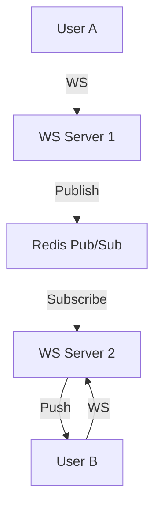

WebSockets provide a persistent, full-duplex communication channel over a single TCP connection. This allows for real-time interaction between a client and a server with very low overhead.

---

## How it Works

1.  **Handshake**: The client sends a standard HTTP request with an `Upgrade: websocket` header.
2.  **Upgrade**: The server responds with `101 Switching Protocols`.
3.  **Connection**: The HTTP connection is "upgraded" to a WebSocket. Both sides can now send data (frames) at any time.

---

## Key Characteristics

-   **Full-Duplex**: Both client and server can send messages simultaneously.
-   **Persistent**: The connection stays open until one side closes it or it times out.
-   **Low Overhead**: Once the connection is established, each message (frame) has only a few bytes of header overhead, compared to the hundreds of bytes in an HTTP header.

---

## Comparison: WebSockets vs. HTTP

| Feature | WebSockets | HTTP / REST |
| :------- | :--- | :--- |
| **Communication** | Bidirectional (Full-Duplex) | Unidirectional (Req-Res) |
| **Connection** | Long-lived / Stateful | Short-lived / Stateless |
| **Overhead** | Low (after handshake) | High (headers in every req) |
| **Real-time** | Excellent | Limited (polling needed) |

---

## Common Use Cases

1.  **Chat Applications**: Instant message delivery.
2.  **Live Dashboards**: Stock prices, sports scores, system metrics.
3.  **Collaborative Editing**: Like Google Docs or Figma where multiple users edit simultaneously.
4.  **Gaming**: High-frequency updates between client and server.

---

## Challenges at Scale

Scaling WebSockets is much harder than scaling REST because they are **Stateful**.

-   **Load Balancing**: A load balancer must support "Sticky Sessions" or use a specialized layer to track which server holds which client's connection.
-   **Memory**: Each open connection consumes memory on the server. A single server might only handle ~50k-100k concurrent connections.
-   **Pub/Sub Integration**: If Client A (on Server 1) sends a message to Client B (on Server 2), you need a back-end system (like Redis Pub/Sub) to route that message between servers.

---

## Key Takeaway

WebSockets are the gold standard for **Real-Time Responsiveness**. However, they come with significant operational costs in terms of state management and scaling. Use them only when real-time interaction is a core requirement.
