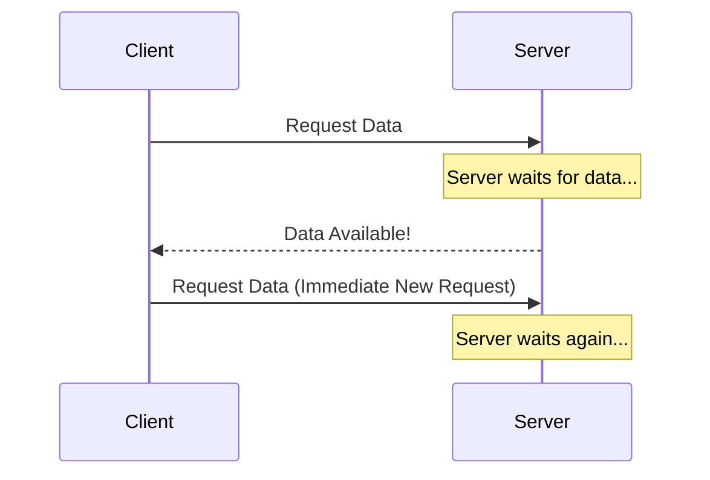

Before WebSockets became widely supported, developers used **Polling** and **Long Polling** to simulate real-time behavior over standard HTTP.

---

## 1. Short Polling (Traditional Polling)

The client repeatedly sends HTTP requests to the server at fixed intervals to check for new data.

### How it Works
1.  Client: "Is there anything new?"
2.  Server: "No." (Wait 5 seconds)
3.  Client: "Is there anything new?"
4.  Server: "Yes, here is the data."

### Pros
-   Simple to implement.
-   Stateless on the server side.

### Cons
-   **High Overhead**: Every request includes full HTTP headers.
-   **Empty Responses**: Most requests return nothing, wasting server resources and bandwidth.
-   **Delay**: Data is only retrieved after the next poll.

---

## 2. Long Polling (Hanging GET)

The client sends a request, and the server **holds the request open** until new data is available or a timeout occurs.

### How it Works
1.  Client: "Is there anything new?"
2.  Server: (Waits until data is ready or 30 seconds pass)
3.  Server: "Yes, here is the data" (or "No, timeout").
4.  Client: Immediately sends a *new* request to start the process again.

### Pros
-   **Instant Delivery**: Data is sent as soon as it's ready.
-   **Lower Overhead**: Fewer requests than short polling.

### Cons
-   **Resource Intensive**: The server must keep many TCP connections open (similar to WebSockets).
-   **Complexity**: Requires handling timeouts and re-connection logic on both sides.

---

## Comparison Table

| Feature | Short Polling | Long Polling | WebSockets |
| :------- | :--- | :--- | :--- |
| **Connection** | Many short ones | One long one (re-created) | One permanent one |
| **Real-time** | Low (Delay) | High (Instant) | Highest (Instant) |
| **Overhead** | Very High | Medium | Very Low |
| **Server Load**| High (many requests) | High (open connections) | Medium (stateful) |

---

## Key Takeaway

Use **Short Polling** for non-critical background updates (e.g., checking for app updates). Use **Long Polling** only as a fallback for WebSockets in environments where persistent connections are blocked. For modern real-time apps, WebSockets are almost always the better choice.
