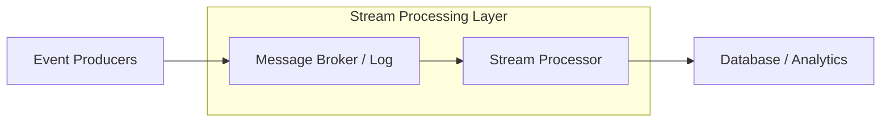

Data streaming is the continuous flow of data as it's generated by various sources. Instead of processing data in large "batches" at the end of the day, streaming allows for processing "in-flight".

---

## 1. Streaming for Clients (SSE & Media)

### Server-Sent Events (SSE)
A unidirectional communication method where a server can push data to a client over HTTP. 
- **Pros**: Uses standard HTTP; automatic reconnection.
- **Cons**: Only Server-to-Client; limited to 6 concurrent connections per browser.

### Media Streaming (HLS / DASH)
Breaking media files (video/audio) into small chunks (2-10 seconds long). The client downloads these chunks sequentially.
- **Goal**: Minimize start time and allow for "Adaptive Bitrate" (switching quality based on internet speed).

---

## 2. Streaming for Systems (Event Streaming)

In distributed systems, streaming refers to the continuous ingestion and processing of event logs.

### Key Concepts
- **Producer**: Generates a stream of events (e.g., website clicks).
- **Stream Processor**: Performs real-time logic (e.g., fraud detection, real-time analytics).
- **Sink**: The final destination (e.g., a database or dashboard).

---

## Batch vs. Stream Processing

| Feature | Batch Processing | Stream Processing |
| :------- | :--- | :--- |
| **Data Size** | Large, finite datasets | Infinite streams |
| **Latency** | High (mins/hours) | Very Low (ms/seconds) |
| **Complexity** | Simple | High |
| **Use Case** | Billing, Monthly reports | Stock trading, Fraud detection |

---

## Common Streaming Architecture

---

## Popular Technologies
- **Ingestion**: Apache Kafka, Amazon Kinesis.
- **Processing**: Apache Flink, Apache Spark Streaming.
- **Storage**: Time-series databases (InfluxDB, Prometheus).

---

## Key Takeaway

Streaming is about **freshness**. If your business needs to react to data within seconds (e.g., alerting when a server's CPU is 99% or detecting a stolen credit card), you need a streaming architecture. If you can wait until the next day, stick to batch processing.
