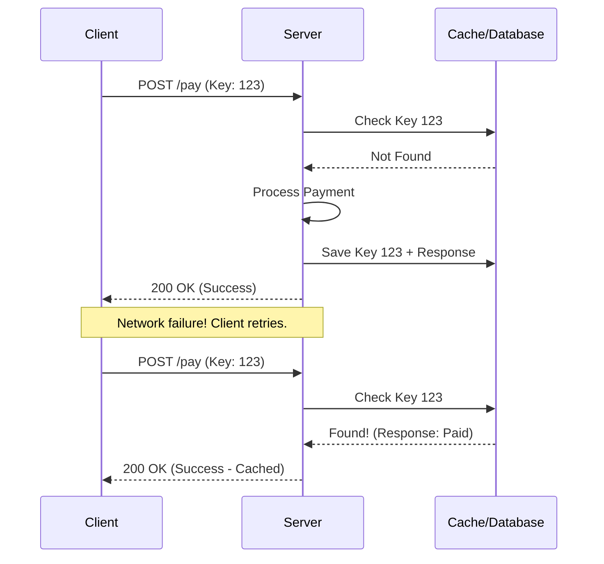

Idempotency is the property of certain operations in mathematics and computer science whereby they can be applied multiple times without changing the result beyond the initial application.

In system design, an idempotent API ensures that making the same request multiple times has the same effect as making it once.

---

## Why is it Critical?
In distributed systems, networks are unreliable. If a client sends a request and doesn't get a response, they don't know if:
1.  The request never reached the server.
2.  The server crashed while processing.
3.  The response was lost on the way back.

Without idempotency, retrying a "Pay $100" request could result in the user being charged multiple times.

---

## HTTP Methods and Idempotency

| Method | Idempotent? | Why? |
| :------- | :--- | :--- |
| **GET** | Yes | Fetching data doesn't change it. |
| **PUT** | Yes | Replacing a resource with the same data multiple times results in the same state. |
| **DELETE** | Yes | Deleting something that is already deleted leads to the same state (gone). |
| **POST** | **No** | Creating a resource twice usually creates two records. |
| **PATCH** | No (usually) | Depends on the implementation (e.g., "Add 5 to balance" is not idempotent). |

---

## How to Implement Idempotency (The Idempotency Key)

The standard way to make a non-idempotent operation (like POST) safe is to use an **Idempotency Key** (usually a UUID).

### The Workflow
1.  **Client** generates a unique `Idempotency-Key` and sends it in the header.
2.  **Server** checks if this key exists in the database.
3.  **If Key Exists**: Return the cached response from the previous success.
4.  **If Key New**: Process the request, store the result + key in the DB, and return the response.

---

## Key Takeaway

Idempotency is the only way to build reliable distributed systems that handle retries safely. Always use idempotency keys for any critical "write" operations, especially in financial or ordering systems.
