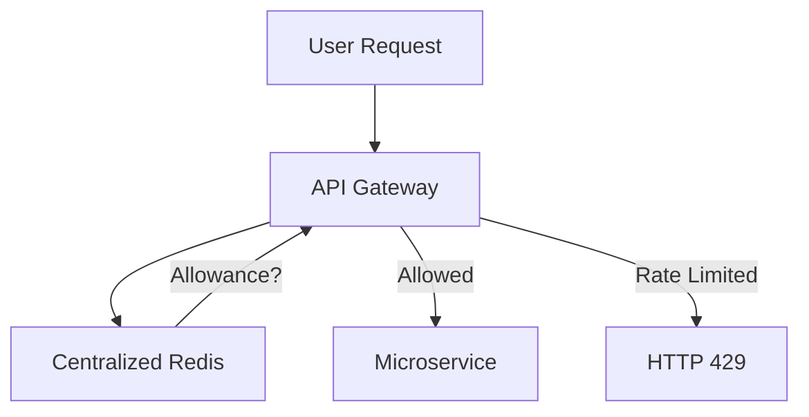

Rate limiting is the process of controlling the rate of traffic sent or received by a network interface or a service. It is used to prevent abuse, protect server resources, and manage costs.

---

## Why Use Rate Limiting?

- **Prevent DDoS Attacks**: Stop malicious actors from overwhelming your system.
- **Resource Management**: Ensure "Noisy Neighbors" don't consume all resources in a shared environment.
- **Cost Control**: Avoid massive bills in pay-per-request cloud services.
- **SLA Enforcement**: Limit users based on their subscription tier (e.g., Free vs. Pro).

---

## Rate Limiting Algorithms

### 1. Token Bucket

A "bucket" holds a set number of tokens. Each request consumes one token. Tokens are added back at a fixed rate.

- **Pros**: Allows for "bursts" of traffic if tokens have accumulated. Simple to implement.
- **Cons**: None significant. This is the most popular algorithm (used by AWS, Stripe).

### 2. Leaky Bucket

Requests enter a bucket and "leak" out at a constant rate for processing. If the bucket is full, new requests are dropped.

- **Pros**: Forces a stable, constant output rate.
- **Cons**: Does not allow for bursts.

### 3. Fixed Window Counter

Counts requests in fixed time windows (e.g., 60 seconds). If the count exceeds the limit, requests are blocked until the next window.

- **Pros**: Very low memory usage.
- **Cons**: Traffic spikes at the edges of windows can allow double the intended traffic.

### 4. Sliding Window Log

Tracks every request timestamp in a log. On each request, it counts logs in the last N seconds.

- **Pros**: Extremely accurate.
- **Cons**: High memory usage (stores every request).

---

## Where to Implement Rate Limiting?

1. **Client-Side**: Good for user experience (don't make requests you know will fail) but easily bypassed by attackers.
2. **API Gateway / Proxy**: The best place for protection. It blocks requests before they reach your internal network.
3. **Application Side**: Good for business-logic-specific limits (e.g., "Max 5 bank transfers per day").

---

## Returning Errors

When a request is rate-limited, the server should return:

- **HTTP 429 (Too Many Requests)**.
- **Retry-After Header**: Tells the client how many seconds to wait before trying again.

---

## Distributed Rate Limiting

In a multi-server setup, you cannot store the count in local memory. You must use a centralized fast-access store like **Redis**.

---

## Key Takeaway

Rate limiting is an essential security and stability layer. **Token Bucket** is almost always the best starting point for general-purpose APIs due to its support for traffic bursts and simplicity.
