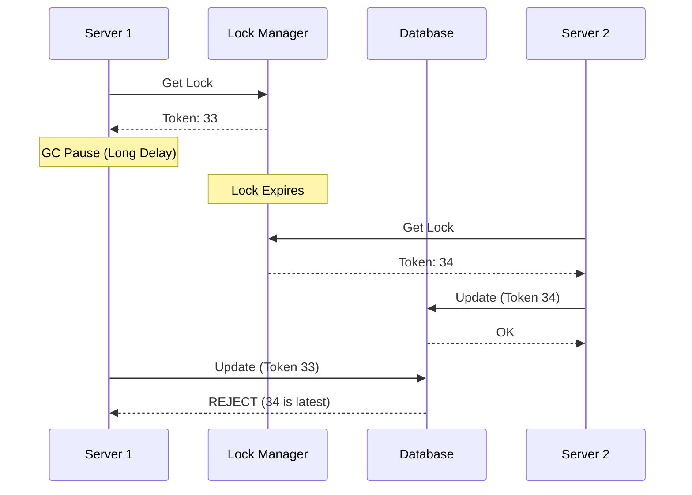

In a single-machine system, you use a **Mutex** or **Semaphore** to prevent multiple threads from accessing the same resource at once.

But what if you have multiple servers?

A local lock won't work because different servers don't share memory.

This is where **Distributed Locking** comes in.

---

## Why Distributed Locking is Required

Without it, you run into **Race Conditions**.

### Example: Booking a Ticket

1. User A checks if a seat is available on Server 1.
2. User B checks the *same* seat on Server 2 at the exact same time.
3. Both servers see the seat is free.
4. Both servers book the same seat.

Result: Two people have the same ticket.

---

## How It Works

A distributed lock needs a **centralized source of truth** that all servers can check.

The process:
1. Server 1 asks the central store for a lock on "Seat_42".
2. Central store grants the lock (usually with a timeout/TTL).
3. Server 2 asks for the same lock.
4. Central store says "No, Server 1 has it."
5. Server 1 finishes booking and releases the lock.

---

## Common Tools for Locking

### 1. Redis (Redlock)
- Very fast.
- Uses a "Set NX" (Set if Not Exists) command with a TTL.
- **Good for**: Performance-heavy operations where a rare failure is okay.

### 2. ZooKeeper
- Extremely reliable.
- Uses "Ephemeral Nodes" that vanish if the client disconnects.
- **Good for**: Critical systems where correctness is more important than speed.

### 3. Etcd
- Used by Kubernetes.
- Distributed and highly available.

---

## The "Fencing Token" Problem

What if Server 1 gets the lock, but then it pauses (due to Garbage Collection) for a long time?

- The lock expires.
- Server 2 gets the lock and finishes the job.
- Server 1 wakes up and also tries to finish the job.

**Solution: Fencing Tokens**
- Each lock comes with a version number that increases.
- The storage layer only accepts the update if the token is the latest one.

---

## Key Takeaways

- Local locks don't work in distributed systems.
- Use a centralized store (Redis, ZK) to manage locks.
- Use **TTLs** to prevent a server from holding a lock forever if it crashes.
- Use **Fencing Tokens** to prevent "stale" updates after a pause.

> Only use distributed locks when you absolutely have to. They add latency and complexity.
