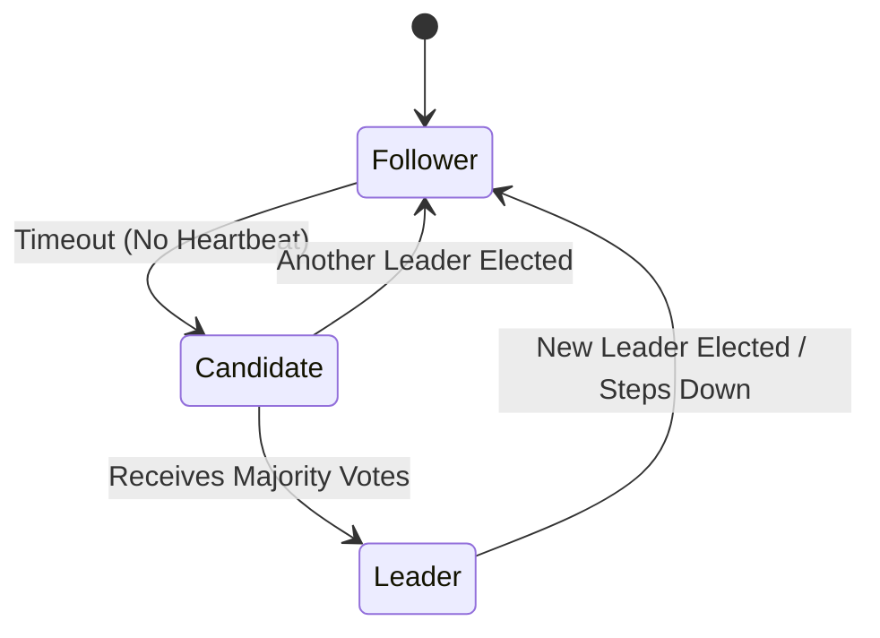

In many distributed systems, someone needs to be "in charge."

- Who should coordinate writes?
- Who should manage the cluster state?
- Who should schedule background tasks?

This role is called the **Leader** (or Master).

---

## 1. Leader Election

Leader election is the process of picking one node to be the coordinator among a group of identical nodes.

### Why do we need it?
If all nodes try to coordinate at once, you get conflicts and data corruption.

### How it works
1. Nodes start an election.
2. They use a **Consensus Algorithm** (like Raft) to agree on one leader.
3. Once elected, the leader handles the coordination.

---

## 2. Heartbeats

How do we know if the leader is still alive?

Nodes send periodic signals called **Heartbeats**.

### The Workflow
- The **Leader** sends a "Heartbeat" to all followers every few seconds.
- As long as followers receive heartbeats, they stay as followers.
- If a follower hasn't heard from the leader for a set time (Timeout), it assumes the leader is dead.

---

## 3. What if the Leader Fails?

When the heartbeat stops:
1. The followers detect the failure.
2. They trigger a **new election**.
3. A new leader is chosen, and the cluster continues.

---

## Split-Brain Problem (Scary!)

What if a network partition happens and the leader is separated from half the cluster?

- One half thinks the leader is dead and elects a **new one**.
- Now you have **two leaders**.
- Both try to write data.

**Result**: Massive data corruption.

### The Solution: Quorum
A leader must always have a **Majority (Quorum)** of nodes supporting it.
- If a node can't see the majority, it cannot become or remain a leader.

---

## Key Takeaways

- **Leaders** simplify coordination in distributed systems.
- **Heartbeats** are the "pulse" used to detect node failures.
- **Quorum** (N/2 + 1) is essential to prevent multiple leaders (Split-Brain).

> In production, you rarely implement this yourself. You use tools like **Etcd** or **ZooKeeper** to handle the heavy lifting.
