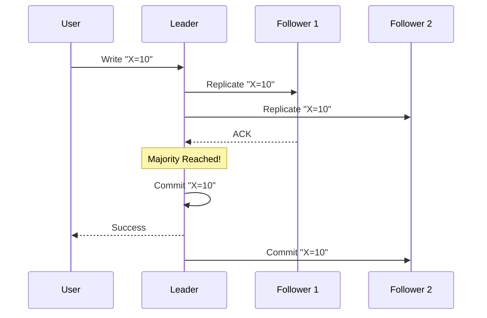

In a distributed system, how do multiple nodes agree on a single value?

This is called **Consensus**.

It is one of the hardest problems in computer science.

---

## Why Consensus is Hard

Nodes can fail. Networks can be slow. Messages can be lost.

If three servers need to decide whether User A has $10 left:
- Server 1 says "Yes".
- Server 2 says "Yes".
- Server 3 says "No" (because it missed an update).

How do they reach an agreement?

---

## The Two Big Algorithms

### 1. Paxos
- The original consensus algorithm (by Leslie Lamport).
- Notoriously difficult to understand and implement.
- **Used by**: Google (Chubby), many academic systems.

### 2. Raft
- Designed to be **understandable**.
- Uses the "Leader Election" model we discussed in the previous section.
- **Used by**: Etcd (Kubernetes), CockroachDB, Consul.

---

## How Raft Works (Simplified)

Raft works by following three steps:

### Phase 1: Leader Election
- Nodes start as followers.
- If they don't hear from a leader, one becomes a "Candidate".
- It asks for votes. If it gets a **Majority (Quorum)**, it becomes the Leader.

### Phase 2: Log Replication
- Every write request goes to the Leader.
- The Leader tells all followers: "Hey, add this to your log."
- Followers acknowledge the message.

### Phase 3: Commitment
- Once the Leader hears back from a **Majority**, it "Commits" the update.
- The change is now permanent.

---

## What Happens During Failure?

If the Leader crashes:
1. Followers wait for a timeout.
2. They realize the leader is gone.
3. They start a new election.

If a Follower crashes:
1. The leader keeps sending heartbeats.
2. When the follower wakes up, it catches up on the missing logs from the leader.

---

## Key Takeaways

- Consensus ensures **all nodes agree** on the state of the system.
- **Quorum** (Majority) is the magic rule. As long as N/2 + 1 nodes are alive, the system works.
- **Raft** is the modern standard for building reliable distributed systems.

> Consensus is the foundation of **Strong Consistency**. Without it, you cannot build databases that guarantee data accuracy at scale.
