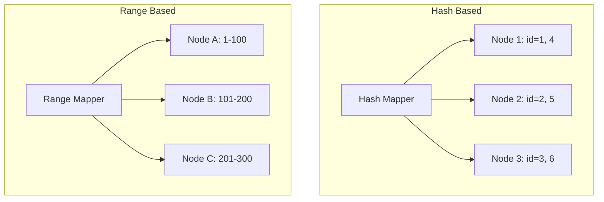

When a dataset is too big for a single machine, we split it up.

This is called **Partitioning** (or Sharding).

The goal is to distribute the data so that every node handles just a small piece of the total load.

---

## 1. Hash-Based Partitioning

We use a hash function on a key (like `user_id`) to determine which node gets the data.

### How it works

- Take a `user_id`: 12345
- Calculate `hash(12345) % total_nodes`
- If the result is 2, the data goes to Node 2.

### Pros

- **Even Distribution**: Data is spread almost perfectly across servers.
- **Prevents Hotspots**: Even if you have 1M active users, they are hashed to different nodes.

### Cons

- **Resharding is Hard**: If you add a new node, the "modulo" change means almost every piece of data has to move. (Solved by **Consistent Hashing**).
- **No Range Queries**: You can't ask for "everyone with ID between 10 and 20" because they are on different nodes.

---

## 2. Range-Based Partitioning

We split data based on sorted ranges of keys (like letters A-Z or IDs 1-1000).

### How it works

- Node 1: User IDs 1 to 1000
- Node 2: User IDs 1001 to 2000
- Node 3: User IDs 2001 to 3000

### Pros

- **Range Queries**: Very fast. You can easily fetch all users in a specific segment.
- **Ordered Data**: Keep related data physically close together.

### Cons

- **Hotspots (The Celebrity Problem)**: If one range is much more active than others, that node gets overloaded while others sit idle.
- **Example**: If you partition by date, the "Today" node handles all writes while the "Last Year" node does nothing.

---

## Comparison Summary

| Feature          | Hash-Based           | Range-Based                |
| :--------------- | :------------------- | :------------------------- |
| **Data Balance** | Excellent (Random)   | Risk of Hotspots           |
| **Query Type**   | Point Lookups (ID=1) | Range Scans (ID > 10)      |
| **Complexity**   | Simple               | Requires indexing/metadata |
| **Example**      | Cassandra, DynamoDB  | HBase, MongoDB             |

---

## Visual Concept

---

## Key Takeaways

- **Partitioning** lets you scale to petabytes of data.
- **Hash-based** is best for uniform load distribution.
- **Range-based** is best when you need to fetch ordered data.

> Always pick a **Shard Key** that is permanent and used in almost every query. A bad shard key is the #1 cause of slow databases at scale.
