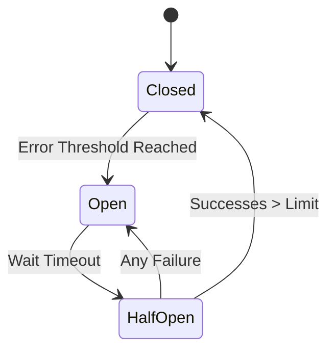

In a distributed system, failures are not just possible—they are **guaranteed**.

Hard drives die. Power cables get tripped over. Software crashes.

If you don't design for failure, a single small error can cause a **Cascading Failure** that takes down your entire company.

---

## 1. Retry Mechanisms

When a request fails, the simplest thing is to try again.

But don't just retry immediately as fast as possible. This is called a **Retry Storm** and it can crash a server that is already struggling.

### The Solution: Exponential Backoff + Jitter
1. **Exponential Backoff**: Increase the wait time between retries (e.g., 1s, 2s, 4s, 8s).
2. **Jitter**: Add a small amount of randomness to the wait time. This prevents all clients from hitting the server at the exact same millisecond.

---

## 2. Circuit Breakers

A circuit breaker prevents an application from repeatedly trying to execute an operation that is likely to fail.

### The Phases:
1. **Closed**: Everything is normal. Requests flow through.
2. **Open**: Error rate exceeds a threshold. Requests are blocked immediately (fail-fast) to allow the failing service to recover.
3. **Half-Open**: After a timeout, allow a small number of requests through. If they succeed, close the "circuit". If they fail, open it again.

---

## 3. Graceful Degradation (Fallbacks)

If a non-critical service fails, the system should keep working with reduced functionality.

### Example: E-commerce Site
- **Primary**: Show a list of objects "Recommended for you" based on complex ML algorithms.
- **Fail-over**: If the ML service is down, show a static list of "Best Sellers".
- **Result**: The user can still shop. They might not notice the failure at all.

---

## 4. Timeouts

Never wait forever for a network response.

Every request must have a **Timeout**.
- If the server hasn't responded in 5 seconds, cut the connection and handle the error.
- This prevents "hanging" requests from consuming all your server's memory and threads.

---

## Key Takeaways

- **Expect failures** and design for them from Day 1.
- **Circuit Breakers** protect your system from cascading failures.
- **Exponential Backoff + Jitter** protects your system from retry storms.
- **Fallbacks** ensure the system stays usable even when pieces are missing.

> A "Resilient" system isn't one that never fails. It's one that recovers gracefully when it does.
