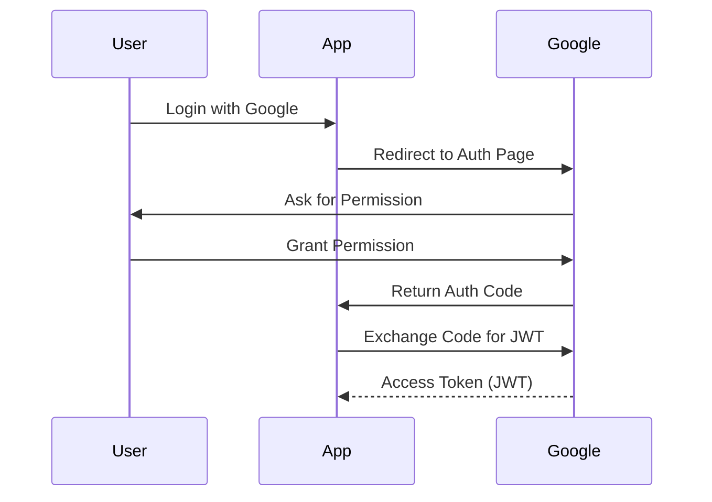

Modern web applications use **OAuth 2.0** for authorization and **JSON Web Tokens (JWT)** to securely transmit information.

---

## 1. OAuth 2.0

OAuth 2.0 is an industry-standard protocol for authorization. It allows a website or app (the "Client") to access resources on another service (the "Resource Server") on behalf of a user, without the user sharing their password.

### The "Delegation" Analogy: The Valet Key
Imagine you give a valet your car keys. You don't give them your house keys or your wallet—only the key that allows them to drive the car. That is OAuth.

---

## 2. JWT (JSON Web Tokens)

A JWT is a compact, URL-safe means of representing claims to be transferred between two parties.

### Structure of a JWT:
1.  **Header**: Algorithm used (e.g., HS256).
2.  **Payload**: The data (claims) like `user_id`, `role`, and `expiration`.
3.  **Signature**: Verifies that the sender of the JWT is who it says it is and to ensure that the message wasn't changed along the way.

```text
Header.Payload.Signature
```

---

## The Workflow (Authorization Code Flow)

1.  **User** clicks "Login with Google".
2.  **App** redirects user to Google's Authorization Server.
3.  **User** logs in and grants permission.
4.  **Google** sends an **Authorization Code** back to the App.
5.  **App** exchanges this code for an **Access Token** (usually a JWT).
6.  **App** uses the **Access Token** to call Google APIs.



---

## Stateful vs. Stateless Auth

### Stateful (Session Based)
-   Server stores a "Session ID" in memory/database.
-   **Pros**: You can revoke a session instantly.
-   **Cons**: Hard to scale (requires sticky sessions or a shared DB like Redis).

### Stateless (JWT Based)
-   All info is stored *inside* the token itself.
-   **Pros**: Extremely scalable. No database lookup needed for every request.
-   **Cons**: Hard to revoke a token before it expires.

---

## Key Takeaways

-   Use **OAuth 2.0** when you need to delegate access to 3rd party services.
-   Use **JWT** for stateless, scalable authentication in microservices.
-   **Important**: JWTs are signed, not encrypted. Anyone can read the payload, so never put sensitive info like passwords inside a JWT.

> JWT is the "passport" of the internet. It says who you are and what you can do, and the signature proves it hasn't been forged.
