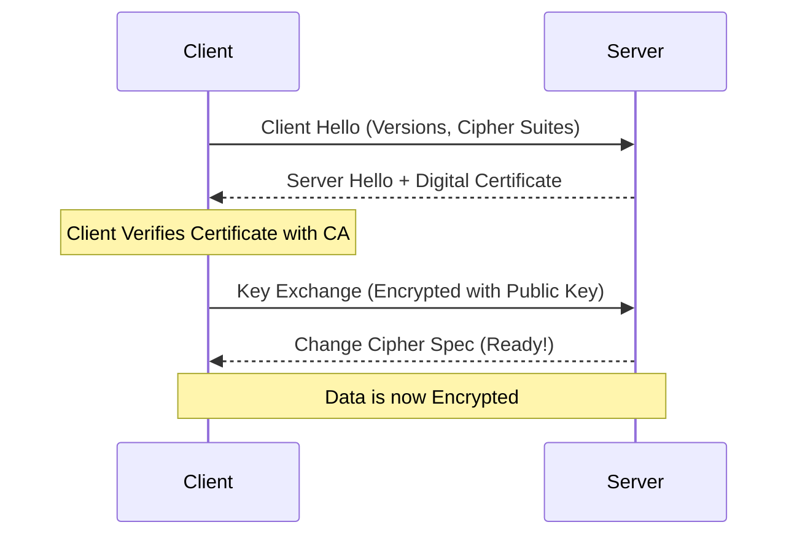

When data is sent over the internet, it passes through many routers and networks that you don't control.

**HTTPS** (Hypertext Transfer Protocol Secure) ensures that this communication is encrypted and protected from "Man-in-the-Middle" (MITM) attacks.

---

## 1. What is TLS?

**TLS** (Transport Layer Security) is the successor to SSL. It is the cryptographic protocol that provides the security for HTTPS.

It provides three main things:
1.  **Encryption**: Hides data from eavesdroppers.
2.  **Authentication**: Ensures you are talking to the real website, not an impostor.
3.  **Integrity**: Ensures data hasn't been tampered with or corrupted during transit.

---

## 2. How it Works (The TLS Handshake)

Before any data is sent, the client and server must agree on how to encrypt it.

1.  **Client Hello**: Client sends supported TLS versions and cipher suites.
2.  **Server Hello**: Server picks the settings and sends its **SSL Certificate**.
3.  **Authentication**: The client validates the certificate using a **Certificate Authority (CA)**.
4.  **Key Exchange**: Client and Server generate a shared **Secret Key** (using Public Key Cryptography).
5.  **Encrypted Session**: All future communication is encrypted using that shared key (Symmetric Encryption).

---

## 3. Why it Matters for System Design

-   **API Security**: All public APIs must use HTTPS to protect user tokens (JWTs) and sensitive data.
-   **Termination at Gateway**: In microservices, we usually "terminate" TLS at the **API Gateway** or **Load Balancer**.
    -   External traffic is HTTPS.
    -   Internal traffic between services is often plain HTTP (to save CPU), unless you have extremely high security requirements (**Zero Trust**).

---

## HSTS (HTTP Strict Transport Security)

HSTS is a header that tells a browser to *only* ever talk to this website over HTTPS, even if the user typed `http://`. This protects against downgrade attacks.

---

## Key Takeaways

-   **HTTPS = HTTP + TLS**.
-   **Certificates** are the "Proof of Identity" verified by trusted 3rd parties (CAs).
-   **SSL Termination** simplifies internal microservice logic but requires a secure private network.

> Security is not a feature; it is a foundation. Without HTTPS, your system is an open book to anyone on the network.
