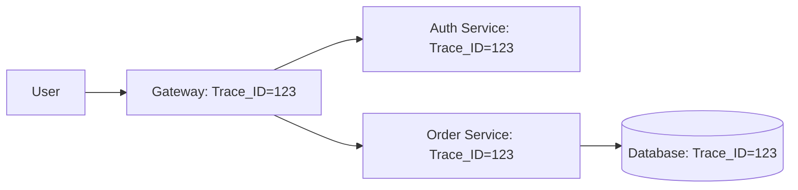

In a distributed system, you can't just "log into the server" to see what's wrong. You might have 1,000 servers.

**Observability** is the ability to understand the internal state of a system based on the data it generates.

It is built on three main pillars: **Logging, Metrics, and Tracing**.

---

## 1. Logging

A record of a specific event that happened at a specific time.

-   **Focus**: What happened?
-   **Structure**: Should be **Structured Logs** (JSON). This makes them easy to search and analyze.
-   **Example**: `{"level": "error", "msg": "DB connection failed", "service": "orders"}`
-   **Tools**: ELK Stack (Elasticsearch, Logstash, Kibana), Grafana Loki.

---

## 2. Metrics

Numerical data measured over time.

-   **Focus**: How is the system performing right now?
-   **Key Metrics (GOLDEN SIGNALS)**:
    -   **Latency**: Time taken for requests.
    -   **Traffic**: Number of requests.
    -   **Errors**: Rate of failed requests.
    -   **Saturation**: How "full" are your resources (CPU/RAM).
-   **Tools**: Prometheus, Grafana, Datadog.

---

## 3. Tracing

Tracking a single request as it travels through multiple services.

-   **Focus**: Where is the bottleneck?
-   **How it works**: A unique **Trace ID** is generated at the API Gateway and passed to every microservice the request touches.
-   **Tools**: Jaeger, Zipkin, OpenTelemetry.

---

## Observability vs. Monitoring

-   **Monitoring**: Tells you *when* something is wrong (e.g., "The site is down").
-   **Observability**: Tells you *why* it is wrong (e.g., "The order service is slow because the database disk is full").

---

## Key Takeaways

-   **Metrics** are for alerting (Fast, cheap).
-   **Logs** are for debugging (Detailed, expensive).
-   **Tracing** is for understanding distributed performance.
-   Always use **Structured Logging** (JSON) to make your data searchable.

> A system that isn't observable is a black box. You aren't managing it; you're just hoping it works.
