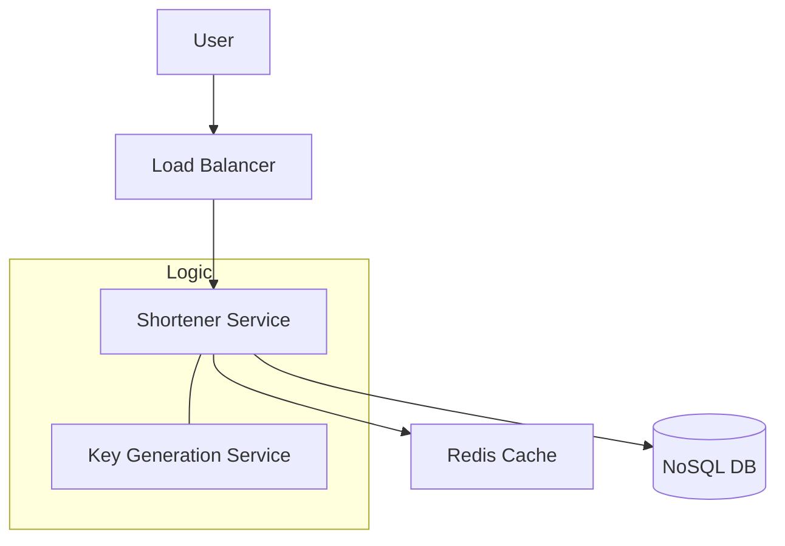

Designing a URL shortener is the classic "Warm-up" system design question. It tests your knowledge of databases, hashing, and scaling.

---

## 1. Requirements

### Functional
- **Shortening**: Given a long URL, return a much shorter, unique URL.
- **Redirection**: When a user visits the short URL, they are redirected to the original long URL.
- **Custom Slugs**: Users should be able to pick their own short links (e.g., `bit.ly/my-awesome-link`).

### Non-Functional
- **High Availability**: Redirection must always work.
- **Low Latency**: The redirect should be near-instant.
- **Scalability**: Handle millions of new URLs and billions of clicks daily.

---

## 2. Capacity Estimation (Scale)

- **New URLs**: 100 million per month (~40 per second).
- **Redirection (Reads)**: 10 billion per month (~4,000 per second).
- **Storage**: 100M URLs/month * 12 months * 5 years = 6 Billion records.
- **Data Size**: Each record ~500 bytes. Total Storage = 6B * 500B = **3 Terabytes**.

---

## 3. High-Level Design

We need two main APIs:
1. `createShortUrl(longUrl)`
2. `getOriginalUrl(shortUrl)`

---

## 4. Deep Dive

### How to Generate the Short Link?

#### Option 1: Hashing (MD5/SHA)
- Hash the Long URL and take the first 7 characters (Base62).
- **Problem**: Collision. Two different long URLs might have the same 7-character hash.
- **Fix**: Keep appending a random string until the collision is gone (Slow).

#### Option 2: Key Generation Service (KGS)
- A separate service pre-generates billions of 7-character unique strings and stores them in a table.
- When the App needs a short link, it just "takes" one from the KGS and marks it as used.
- **Benefits**: No collisions. Very fast.

### Database Choice
A **NoSQL Key-Value store** (like DynamoDB or Cassandra) is perfect here.
- Why? We only ever perform "Point Lookups" (`get long_url where short_id = X`). We don't need complex JOINs.

---

## 5. Trade-offs & Bottlenecks

1.  **Read Optimization**: Since there are 100x more reads than writes, we must use **Redis** to cache the most popular links.
2.  **Statelessness**: The Application server must be stateless so we can add more servers easily during traffic spikes (**Horizontal Scaling**).
3.  **Cleanup**: For a production system, you need a worker to delete or archive old links that haven't been clicked in years.

---

## Key Takeaway

A URL shortener is a **Read-Heavy** system. The secret to success in an interview is choosing a collision-free key generation strategy (like **KGS**) and using aggressive **Caching** to handle the high volume of redirects.
