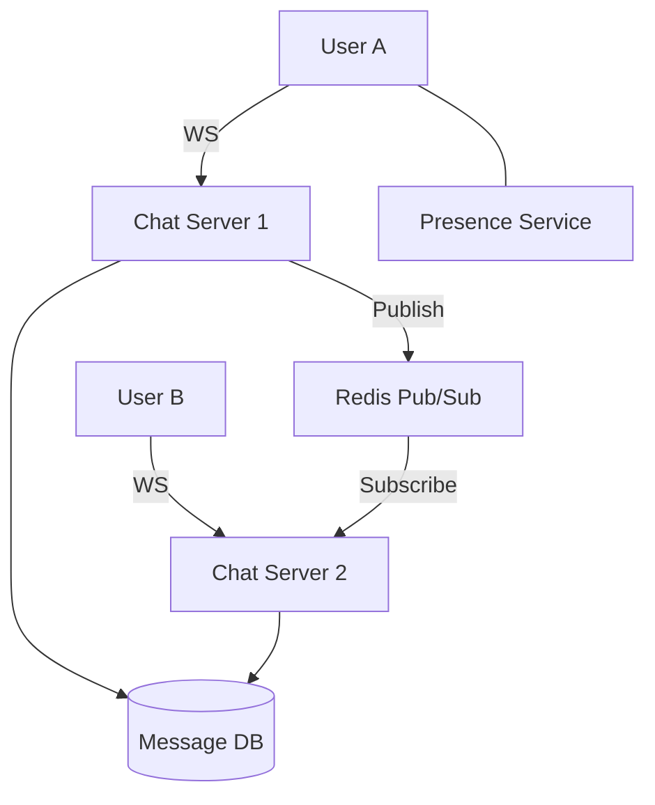

A chat system is a **High-Concurrency** system that requires real-time message delivery and high availability.

---

## 1. Requirements

### Functional
- **One-on-one Chat**: Users can send messages to each other.
- **Presence**: Show if a user is "Online" or "Offline".
- **Delivery Status**: Sent, Delivered, Read receipts.
- **Media**: Support for images and video.

### Non-Functional
- **Real-time**: Near-zero latency for message delivery.
- **Order**: Messages must appear in the correct order.
- **Reliability**: No message should ever be lost.

---

## 2. High-Level Design

At the core of a chat system is the choice of communication protocol. Since the server needs to "push" data to the client, we use **WebSockets**.

---

## 3. Deep Dive

### Message Delivery Workflow
1. User A sends a message via WebSocket to Server 1.
2. Server 1 saves the message to the **Database**.
3. Server 1 checks if User B is online.
4. If User B is on Server 2, Server 1 sends the message via **Redis Pub/Sub** to Server 2.
5. Server 2 pushes the message to User B via their open WebSocket.

### Database Selection
- **Metadata (Users, Contacts)**: Standard SQL (PostgreSQL).
- **Messages**: A "Wide-Column" NoSQL store like **Cassandra** or **HBase**.
    - **Why?** Chat results in massive write volume. Cassandra is optimized for extremely high write throughput and supports horizontal sharding naturally.

### Handling Presence (Online Status)
With millions of users, you can't query the DB every 2 seconds.
- Use a **Heartbeat Mechanism**. The client sends a "pulse" to a `Presence Service` every 30 seconds.
- If the service hasn't heard from a user in 60 seconds, they are marked as **Offline**.

---

## 4. Scalability & Fault Tolerance

1.  **Stateful Servers**: Since WebSockets are stateful, you need a way to track which user is connected to which server.
2.  **Disconnected Clients**: If a user is offline, the message is stored in the DB. When they reconnect, they "Pull" all missing messages (similar to a **Message Queue**).
3.  **End-to-End Encryption**: Messages are encrypted on User A's phone and only decrypted on User B's phone. No one (including you) can read them in the middle.

---

## Key Takeaway

A chat system is all about **Persistence** and **State Management**. Success in an interview means explaining how you handle real-time delivery via **WebSockets** and how you scale the message storage using **Cassandra**.
