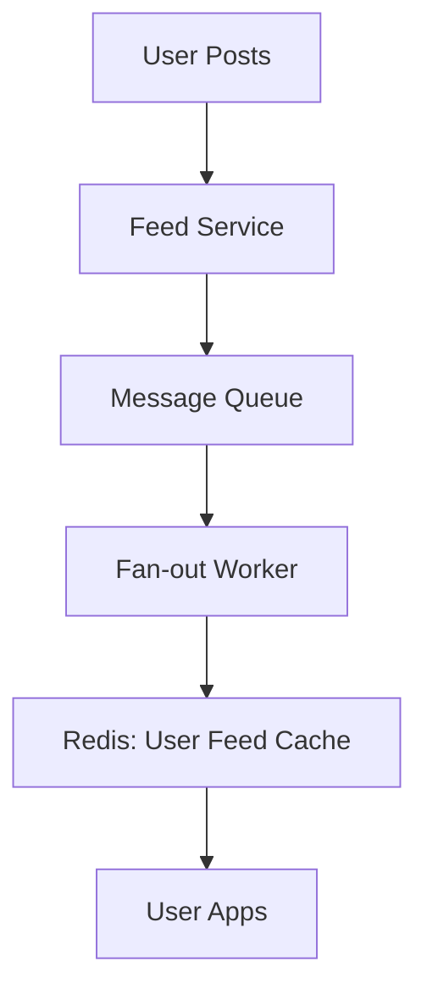

A News Feed is a system that presents a constantly updating list of stories/posts from people you follow.

---

## 1. Requirements

### Functional
- **Post Feed**: User sees posts from people they follow.
- **Publish Post**: User can post text, images, or video.
- **Infinite Scroll**: New posts load as the user scrolls down.

### Non-Functional
- **High Availability**: Users should always see a feed.
- **Low Latency**: Scrolling and loading should be fast.
- **Eventual Consistency**: It's okay if a post takes a few seconds to appear in a friend's feed.

---

## 2. High-Level Design (The Pull vs. Push Model)

There are two ways to build a feed:

### Option A: Pull (Fan-out on Read)
When a user opens their feed, the system looks at the list of everyone they follow and fetches their latest 10 posts.
- **Pros**: Easy to implement. Good for users with very few followers.
- **Cons**: Extremely slow for the "Read" operation if a user follows 1,000 active posters.

### Option B: Push (Fan-out on Write)
When a user posts a photo, the system immediately "pushes" that post into the pre-computed feed buckets of all their followers.
- **Pros**: Reading the feed is instant (just fetch from the user's bucket).
- **Cons**: The **"Celebrity Problem"**. If a celebrity with 50M followers posts, you have to perform 50M writes immediately. This could crash the system.

---

## 3. Hybrid Design (The Real Choice)

In an interview, the best answer is a **Hybrid Approach**:
- **Push** for regular users.
- **Pull** for celebrities. When a user opens their feed, they "Push" their normal friends' content and "Pull" from any celebrities they follow.

---

## 4. Deep Dive: Feed Ranker

You don't just show posts by time; you show them by **relevance**.
- A Ranking Service analyzes your signals (which posts you click, which users you like).
- It returns a "Score" for each post.
- The Feed Service sorts the feed based on these scores.

---

## 5. Scalability & Storage

1.  **Media Storage**: Use **Blob Storage (S3)** for images and a **CDN** to serve them to users globally.
2.  **Stateless API**: Use an **API Gateway** to handle authentication and rate limiting.
3.  **Cache-First**: The pre-computed feed should be stored in **Redis**. This ensures that the majority of users get their feed with sub-50ms latency.

---

## Key Takeaway

The secret to a social media feed is understanding the **Read-Heavy** nature of the system and solving the **Celebrity Problem** using a hybrid Push/Pull fan-out model.
