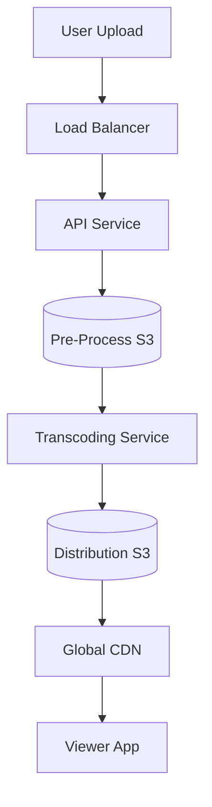

Streaming high-quality video to millions of users globally is one of the most complex challenges in system design.

---

## 1. Requirements

### Functional
- **Upload**: User can upload videos.
- **Streaming**: User can watch videos on different devices (Phone, TV, PC).
- **Search**: Search for videos by title.

### Non-Functional
- **Scalability**: Support billions of videos and users.
- **Low Latency**: Video should start playing immediately (low "Rebuffering").
- **Reliability**: Videos should not be lost.

---

## 2. High-Level Design (The Upload Flow)

When a user uploads a video, the system doesn't just store it as-is. It must process it.

1.  **Original File** is stored in **Pre-processor Blob Storage**.
2.  **Transcoding Workers** pick up the file and convert it into multiple resolutions (360p, 720p, 1080p, 4k) and formats (HLS, DASH).
3.  **Encrypted/Chunked** files are stored in a **Distribution Blob Storage**.
4.  **CDN** pulls the chunks and serves them to the user.

---

## 3. Deep Dive: Streaming Efficiency

### Adaptive Bitrate Streaming (ABS)
The system doesn't send the same video data to everyone.
- It detects the user's internet speed.
- If the speed drops, it automatically switches the user to a lower resolution (e.g., from 1080p to 480p) mid-stream without stopping playback.

### Video Chunking
Videos are split into small chunks (2-5 seconds long).
- The client app only downloads the next few chunks.
- If the user stops watching, the system doesn't waste bandwidth downloading the entire 2-hour movie.

---

## 4. Scalability: The Data Layer

1.  **Metadata Database**: User info, video titles, and tags are stored in a **Sharded SQL** database.
2.  **CDN (The Real Hero)**: 99% of video traffic should never hit your servers. Use CDNs (Cloudflare, Akamai, or custom like Netflix Open Connect) to cache video chunks as close to the user as possible (the "Edge").

---

## 5. Security

- **DRM (Digital Rights Management)**: Encrypt video chunks so only authorized users can play them.
- **Pre-signed URLs**: Ensure only authenticated users can access the direct link to the video file from the CDN.

---

## Key Takeaway

A video streaming platform is a **Write-Once, Read-Many-Millions** system. The secret to scale is **Transcoding** (preparing the data) and heavy reliance on **CDNs** (delivering the data).
