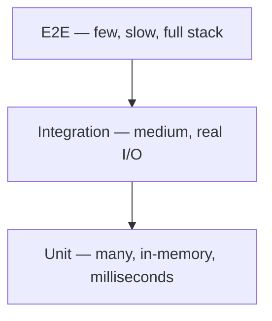

You cannot test everything the same way. A test that boots a browser, logs in, and clicks checkout proves a lot and costs a lot. A test that calls `discount(price, coupon)` in-process proves one thing in milliseconds.

The **testing pyramid** is a budget: many cheap tests at the bottom, few expensive ones at the top. The budget exists because CI time, flakiness, and debugging time are finite.



> [!TIP]
> **ELI5: Building inspection**
> Unit tests are tapping bricks (is this brick cracked?). Integration tests turn on the plumbing (does water reach the tap?). E2E is living in the house for a weekend. You do not live-in-the-house to check every brick. You also do not only tap bricks and call the house done.

## 1. Unit tests — the base

**Scope:** one function, class, or module. No network, no real database, no clock that is "whatever Tuesday is."

**What they catch:** off-by-one, bad branching, parsing, money rounding, permission checks, "does this pure logic match the spec."

**What they cannot catch:** SQL that does not match the schema, the HTTP handler mapping the wrong status code, "Chrome actually posts the form."

```javascript
test("expired coupon is rejected", () => {
  expect(() => applyCoupon(100, { percent: 10, expiresAt: 0 })).toThrow(/expired/);
});
```

Thousands of these should run in seconds. If a "unit" test needs Docker, it is not a unit test.

## 2. Integration tests — the middle

**Scope:** two or more real pieces wired together. Typical: HTTP handler + real Postgres in Docker, or consumer + real queue.

**What they catch:** schema mismatch, transaction boundaries, migrations, "the repository query does not return what the service assumes," contract with a library you did not mock correctly.

**What they still mock:** third-party SaaS (Stripe, SendGrid). Hitting live Stripe in CI is how you get flaky bills and flaky tests.

```javascript
test("POST /orders persists and returns 201", async () => {
  const res = await request(app).post("/orders").send({ sku: "abc" });
  expect(res.status).toBe(201);
  expect(await db.order.count()).toBe(1);
});
```

These take seconds, not milliseconds. Keep them for **paths that touch I/O**, not for every branch of `if`.

## 3. E2E tests — the peak

**Scope:** a real browser (Playwright, Cypress) or a real mobile client against a deployed (or docker-compose) stack.

**What they catch:** the thing users do: signup, checkout, "the button is disabled." Routing, CORS, the frontend calling the wrong URL.

**Cost:** minutes, need seed data, flake when animations or timing change. A failure is often "selector changed," not "business logic is wrong."

Write E2E for a handful of **user journeys**, not for every validation message. Those belong in unit tests of the validator.

## 4. Which layer should catch this bug?

| Bug | Layer |
| :--- | :--- |
| Tax rounding is wrong for 3 items | Unit |
| `INSERT` violates a unique constraint the ORM hid | Integration |
| Checkout button never fires the request | E2E |
| Password hash compare is timing-safe | Unit |
| Migration forgot a NOT NULL default | Integration |
| Login cookie not set in production-like HTTPS | E2E |

If a bug can be caught one layer down, catch it there. Faster signal, cheaper to keep green.

## 5. The ice-cream cone (and the testing trophy)

> [!WARNING]
> **Ice-cream cone:** a mountain of E2E, almost no unit tests. CI is 40 minutes, three tests are always red "until you rerun," and people stop trusting the suite. That is worse than no tests.

Google and others sometimes draw a **trophy**: a bit more integration than a strict pyramid, because for web APIs the adapter-to-database test is the highest value per minute. The rule is the same: **do not put logic-only bugs in Playwright.**

Practical mix for a typical API + SPA:

- Heavy unit on domain/money/authz.
- Integration on each HTTP route happy path + one DB constraint.
- 5–15 E2E journeys (signup, checkout, password reset).

If CI is slower than ~10 minutes, the pyramid is inverted or the integration tests are hitting the public internet.

## What to remember

- Layer is about **what is real**, not the folder name.
- Push tests down: logic in unit, I/O in integration, journeys in E2E.
- Flaky E2E trains the team to ignore red builds. Delete or fix; do not rerun until green and call it CI.
