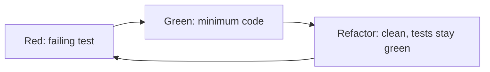

Test-Driven Development means you write a failing test for the next behavior **before** the production code that makes it pass. The test is the spec. The code is the simplest thing that satisfies the spec. Then you clean up.

It is not "write all tests first for the whole feature." It is a tight loop measured in minutes.

> [!TIP]
> **ELI5: The climbing bolt**
> You do not free-solo the whole cliff then add safety. You place a bolt (the test), it would fail if you fell (red), you climb to it (green), you tidy the rope (refactor), next bolt. TDD is placing the next bolt *before* the next move.

## 1. Red → green → refactor



1. **Red.** Write one test for one behavior. Run it. It must fail for the *right* reason (not a syntax error in the test itself). If it passes, you did not test anything new.
2. **Green.** Write the smallest production change that passes. Hard-coding a return is legal if that is the minimum. You are not designing the cathedral yet.
3. **Refactor.** Duplication, names, extract functions. Do not add behavior. The tests pin the behavior so cleanup is safe.

If you skip red, you do not know the test can fail. If you skip refactor, the design rots under a green bar.

## 2. A loop you can feel

Behavior we want: `fizzBuzz(n)` returns `"Fizz"` for multiples of 3, `"Buzz"` for 5, `"FizzBuzz"` for 15, otherwise the number as a string.

**Red** — first test, no function yet:

```javascript
test("returns the number when not a multiple of 3 or 5", () => {
  expect(fizzBuzz(1)).toBe("1");
});
```

Run: `fizzBuzz is not defined`. Good red.

**Green:**

```javascript
export function fizzBuzz(n) {
  return String(n);
}
```

Passes. Ugly. Fine.

**Red** again — multiples of 3:

```javascript
test("multiples of 3 are Fizz", () => {
  expect(fizzBuzz(3)).toBe("Fizz");
  expect(fizzBuzz(6)).toBe("Fizz");
});
```

**Green** — add the `3` branch, not the `5` branch yet. Do not implement the whole kata in one go; that skips the loop.

After Fizz, Buzz, FizzBuzz tests exist, **refactor** the obvious `% 15` first so you do not return `"Fizz"` for 15.

That last sentence is the point of TDD: **order of tests shapes the design.** If you write the 15 case first, you discover the overlap early.

## 3. TDD forces seams (dependency injection)

Code written after the fact often constructs its dependencies internally:

```javascript
function charge(userId, amount) {
  return new StripeClient(process.env.KEY).charge(userId, amount);
}
```

You cannot unit-test this without hitting Stripe or monkey-patching a global. TDD from the outside tends to produce a **seam**:

```javascript
function charge(gateway, userId, amount) {
  return gateway.charge(userId, amount);
}
```

The test injects a fake gateway. Production injects Stripe. That is [dependency inversion](/lld/006-dependency-inversion) showing up because you wanted a fast test, not because a blog said SOLID.

```go
type Gateway interface {
    Charge(userID int, amount float64) error
}

func ChargeUser(g Gateway, userID int, amount float64) error {
    return g.Charge(userID, amount)
}
```

In the test, `g` is a stub that records the amount. In production, `g` is the Stripe adapter.

## 4. What TDD is bad at

> [!WARNING]
> TDD does not design your product. A green bar on the wrong spec is a very confident bug. Also: spike UI, explore a messy API, or learn a library *without* TDD first, then lock behavior with tests.

Skip the strict loop when:

- You are sketching, throwing away code.
- The feedback is visual (CSS) — use a few E2E checks, not 50 unit tests of class names.
- You do not know the algorithm yet; spike, then characterize with tests.

Do use the loop when:

- Money, auth, parsers, state machines, anything with branches that will regress.
- You are scared to refactor. That fear is the signal.

## What to remember

- One failing test, minimum code, then cleanup. Minutes, not hours.
- If the new test did not fail, it is not earning its keep.
- Testable design (inject dependencies) is a side effect of TDD, and the lasting benefit.
- TDD is a spec for behavior you understand. It will not invent the right product.
